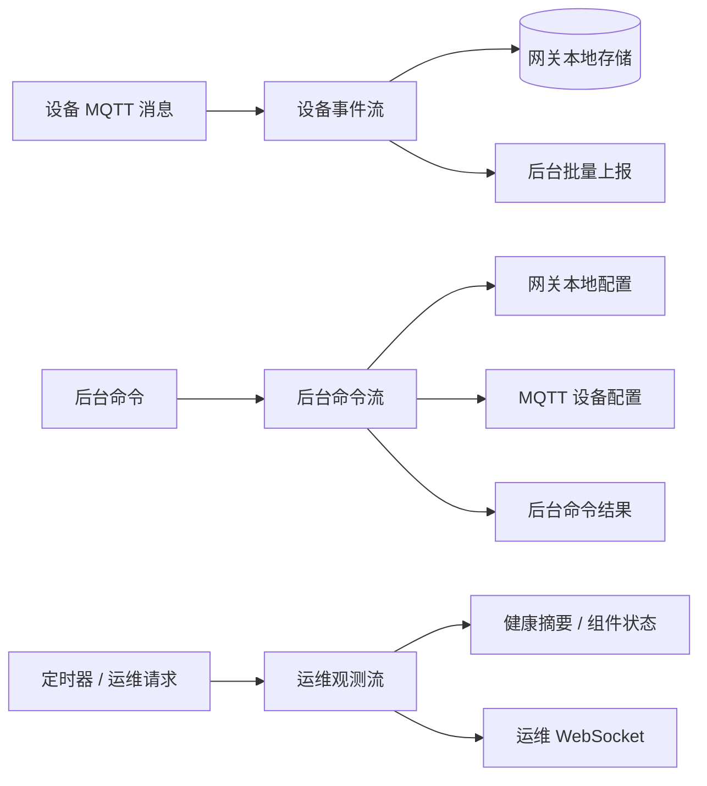

# 网关数据处理流程规范

## 版本说明

| 项目 | 内容 |
|---|---|
| 版本 | `v1.0.0-rc2` |
| 作者 | `CircuitX` |
| 日期 | `2026/05/07` |
| 状态 | 发布候选版 |

## 修改历史

| 版本 | 日期 | 作者 | 说明 |
|---|---|---|---|
| `v1.0.0-rc2` | `2026/05/07` | `CircuitX` | 明确网关生成告警 / 状态事件不通过 MQTT Broker 发布，而是以 MQTT 兼容事件直接写入本地可靠投递存储；批量上传超时统一记录为 `failed` 批次并依赖 `gw_event_id` 幂等重试 |
| `v1.0.0-rc1` | `2026/04/29` | `CircuitX` | 首个发布候选版；定义网关侧设备事件流、后台命令流、运维观测流的数据处理边界与流程语义 |

## 文档说明

本文定义运动感知系统网关侧的数据处理流程规范。本文关注网关在接收设备消息、执行本地判定、写入本地存储、上传后台、下发设备配置、输出运维状态时应遵循的处理顺序、状态变化和异常恢复行为。

本文当前版本为 `v1.0.0-rc2` 发布候选版，按设备事件流、后台命令流、运维观测流三类流程组织内容，并在各流程中描述入站、判定、存储、出站等处理域。外部 MQTT 字段以 [docs/mqtt-schema.md](mqtt-schema.md) 为准；网关本地数据库表结构以 [docs/gateway-db-schema.md](gateway-db-schema.md) 为准；后台 REST API 字段由后续 [docs/gateway-backend-restapi-schema.md](gateway-backend-restapi-schema.md) 定义。

## 1. 文档边界

本文只定义网关数据处理流程，不重复定义 MQTT 字段、本地数据库表结构、后台 REST API 字段或前端页面展示逻辑。相关内容分别由对应契约文档或模块文档负责。

| 项目 | 本文是否负责 | 说明 |
|---|---|---|
| 网关数据处理流程 | 是 | 定义入站、判定、存储、出站和异常恢复的处理顺序 |
| 设备事件流 | 是 | 定义设备 MQTT 消息从进入网关到上传后台的流程 |
| 后台命令流 | 是 | 定义后台命令从进入网关到执行、下发和结果上报的流程 |
| 运维观测流 | 是 | 定义健康检查、运行计数器和运维状态输出流程 |
| MQTT topic / payload 字段 | 否 | 由 `docs/mqtt-schema.md` 定义 |
| 网关本地数据库表结构 | 否 | 由 `docs/gateway-db-schema.md` 定义 |
| 后台 REST API 字段 | 否 | 由 `docs/gateway-backend-restapi-schema.md` 定义；该文档待补齐 |
| 前端页面展示逻辑 | 否 | 由网页端模块文档定义 |
| 具体代码模块划分 | 否 | 本文约束处理语义，不强制代码文件结构 |

## 2. 处理总览

网关侧数据处理按三类主流程组织：设备事件流、后台命令流、运维观测流。三类流程共享同一套网关运行配置、日志、健康状态和本地运行环境，但处理目标不同。

| 流程 | 入口 | 核心目标 | 主要输出 |
|---|---|---|---|
| 设备事件流 | 设备 MQTT 消息、本地判定触发 | 将设备上报和网关生成事件可靠保存，并异步上传后台 | 本地事件、后台批量上报 |
| 后台命令流 | 后台命令通知、后台命令拉取 | 将后台命令应用到网关本地或转发到设备，并回报执行结果 | 网关本地配置变更、MQTT 设备配置、命令执行结果 |
| 运维观测流 | 定时健康检查、运行计数器、运维 API 请求 | 形成网关自身和依赖组件的运行状态，供运维端查看 | 健康摘要、组件状态、运行统计、运维 WebSocket 推送 |



三类流程的处理域如下：

| 处理域 | 说明 |
|---|---|
| 入站 | 接收外部输入，包括 MQTT 设备消息、后台命令、运维查询和定时触发 |
| 判定 | 根据配置、规则、本地状态和消息内容决定后续动作 |
| 存储 | 将需要可靠保留的数据写入本地存储，或更新本地运行状态 |
| 出站 | 将处理结果发送到后台、MQTT Broker、运维接口或 WebSocket；设备事件流的网关生成事件不通过 MQTT 出站 |

### 2.1 路由模型

网关采用边缘路由模型组织数据处理。每类输入先由入站适配器转换为网关内部可处理的标准化对象，再根据消息类型、设备类型、运行配置和本地状态决定后续处理路径。

```text
入站来源 -> 入站适配 -> 标准化对象 -> 路由判定 -> 本地状态 / 存储 -> 出站目标
```

| 路由阶段 | 作用 |
|---|---|
| 入站来源 | MQTT、后台命令、运维请求、定时器、本地配置变化 |
| 入站适配 | 解析协议细节，将外部输入转换为标准化对象 |
| 标准化对象 | 保留后续判定、存储和出站所需的统一上下文 |
| 路由判定 | 根据消息类型、设备类型、规则和本地状态决定处理路径 |
| 本地状态 / 存储 | 写入可靠投递队列，更新连通性、批次、运行缓存 |
| 出站目标 | 后台 REST、MQTT Broker、运维 REST / WebSocket、本地配置 |

路由模型不要求所有输入都经过完整阶段。设备事件必须经过可靠存储后再上传后台；后台命令可以直接应用到本地配置或转发到 MQTT；运维查询可以直接读取最近健康快照和运行计数器。

### 2.2 设备事件流

设备事件流用于处理设备通过 MQTT 上报到网关的业务消息，以及网关基于本地判定生成的内部事件。设备入站覆盖 `telemetry`、`status`、`alert`、`binding` 四类消息；网关生成事件覆盖本地规则告警、离线告警和离线状态。

设备事件流的核心目标是：先在网关本地形成可恢复的事件事实，再异步上传后台；后台短暂不可用时，不应导致已接收设备事件丢失。

| 阶段 | 输入 | 处理 | 输出 |
|---|---|---|---|
| 入站 | 设备 MQTT 消息 | 解析 topic、解码 JSON、校验 action、补充网关接收时间 | 标准化入站事件 |
| 判定 | 标准化入站事件、本地扫描触发 | 更新设备连通性、评估本地规则、扫描离线状态 | 原始事件、规则告警事件、离线事件 |
| 存储 | 原始事件、规则告警事件、离线事件 | 写入本地可靠投递队列，更新设备连通性状态，记录批量投递所需状态 | 待上传事件、设备连通性状态 |
| 出站 | 待上传事件 | 上传后台，成功后更新本地投递状态，失败时保留本地事件 | 后台入库结果、本地投递状态更新 |

### 2.3 后台命令流

后台命令流用于处理后台下发到网关的控制类任务。该流程覆盖后台通知网关拉取命令、网关执行命令、向设备转发配置、以及向后台回报执行结果。

后台命令流的核心目标是：保证后台命令只由目标网关执行，并且每条命令最终形成明确的执行结果。

| 阶段 | 输入 | 处理 | 输出 |
|---|---|---|---|
| 入站 | 后台命令通知、后台 pending 命令 | 接收 WebSocket 唤醒信号，或按轮询兜底拉取待执行命令 | 待执行命令 |
| 判定 | 待执行命令 | 校验目标网关、命令类型、设备类型和配置 payload | 可执行命令、失败结果 |
| 存储 | 命令执行结果 | 缓存尚未成功上报后台的执行结果 | 待上报命令结果 |
| 出站 | 可执行命令、待上报命令结果 | 网关配置命令在本地应用；设备配置命令发布到 MQTT；执行结果上报后台 | 本地配置变更、MQTT config、后台命令结果 |

### 2.4 运维观测流

运维观测流用于处理网关自身运行状态、依赖组件健康状态和运行计数器。该流程覆盖定时健康检查、运维 REST 查询、运维 WebSocket 推送，以及网关内部运行统计。

运维观测流的核心目标是：让后台或运维端能够判断网关服务是否存活、依赖组件是否可用、数据处理链路是否持续工作。

| 阶段 | 输入 | 处理 | 输出 |
|---|---|---|---|
| 入站 | 定时健康检查、运维 REST 请求、运维 WebSocket 连接 | 触发健康采集，读取运行计数器，维护 WebSocket 连接 | 健康采集请求、状态查询请求、WebSocket 会话 |
| 判定 | 组件探测结果、运行计数器 | 判断组件 online 状态和健康等级，汇总网关整体健康状态 | 健康摘要、组件状态、运行统计 |
| 存储 | 健康摘要、组件状态、运行统计 | 缓存最近一次健康采集结果和运行计数器 | 最近健康快照、累计运行统计 |
| 出站 | 最近健康快照、累计运行统计 | 通过 REST 返回状态，通过 WebSocket 推送运维快照 | REST 响应、运维 WebSocket 消息 |

## 3. 入站处理

入站处理定义网关从外部系统或本地运行环境接收输入时的统一处理边界。入站阶段只负责接收、解析、基础校验和标准化，不负责业务规则判定、可靠投递状态流转或最终出站动作。

| 入站类别 | 所属流程 | 入口 | 入站结果 |
|---|---|---|---|
| 设备消息入站 | 设备事件流 | MQTT subscription | 标准化入站事件 |
| 后台命令入站 | 后台命令流 | WebSocket 通知、REST pending 拉取 | 待执行命令 |
| 运维观测入站 | 运维观测流 | REST 请求、WebSocket 连接、定时健康检查 | 状态查询请求、健康采集请求、WebSocket 会话 |
| 本地运行触发 | 设备事件流 / 后台命令流 / 运维观测流 | 定时器、规则文件变化、本地配置更新 | 内部处理触发信号 |

入站处理的通用约束：

| 项目 | 约束 |
|---|---|
| 最小职责 | 入站阶段只做接收、解析、基础格式校验和标准化 |
| 不做最终判定 | 复杂业务判断应进入判定处理章节 |
| 不做可靠投递确认 | 设备事件只有成功进入本地可靠存储后，才视为可靠接收 |
| 不丢失上下文 | 入站标准化结果必须保留后续判定、存储、出站所需的上下文 |

### 3.1 设备消息入站

设备消息入站负责接收设备通过 MQTT 发布到网关本地 Broker 的业务消息。该阶段只处理设备上报方向的消息，不处理网关下发到设备的 `config` 消息。

#### 3.1.1 入站约束

| 项目 | 约束 |
|---|---|
| 入口协议 | MQTT subscription |
| Topic 格式 | `gym/{gym_id}/{device_type}/{device_id}/{action}` |
| 允许 `device_type` | `equipment` / `wristband` / `env` |
| 允许 `action` | `telemetry` / `status` / `alert` / `binding` |
| 不允许 `action` | `config`；`config` 属于网关出站到设备的命令消息 |
| Payload 类型 | JSON object |
| 入站补充字段 | `gateway_received_ts`，Unix 秒级时间戳 |
| 标准化结果 | Topic 解析结果和标准化 Payload |

#### 3.1.2 入站处理顺序

| 顺序 | 步骤 | 失败处理 |
|---|---|---|
| 1 | 接收 MQTT 消息 | MQTT 连接失败时进入重连流程 |
| 2 | 解析 topic | topic 不符合格式时丢弃 |
| 3 | 解码 payload | payload 不是合法 JSON object 时丢弃 |
| 4 | 校验 `device_type` 和 `action` | 不在允许范围内时丢弃 |
| 5 | 补充 `gateway_received_ts` | 使用网关接收该消息时的 Unix 秒 |
| 6 | 生成标准化入站结果 | 交给后续判定和存储处理 |

说明：设备入站阶段只做基础准入和标准化。规则告警、设备离线、可靠投递状态流转不在本阶段处理。

#### 3.1.3 标准化 Payload

设备 MQTT Payload 通过入站处理后，形成标准化 Payload。标准化 Payload 以设备原始 MQTT Payload 为基础，补充网关入站预处理字段，供后续判定、存储和后台上报使用。

| 字段类别 | 字段 | 来源 | 说明 |
|---|---|---|---|
| 设备业务字段 | 见 `docs/mqtt-schema.md` | 设备 | 保留设备原始上报字段，不在入站阶段改写业务含义 |
| 网关入站预处理字段 | `gateway_received_ts` | 网关 | 网关接收 MQTT 消息的 Unix 秒级时间戳 |

标准化 Payload 示例：

```json
{
  "ts": 1712640000,
  "power_w": 320.5,
  "rated_power_w": 500.0,
  "energy_wh": 0.382,
  "gateway_received_ts": 1712640009
}
```

| 项目 | 约束 |
|---|---|
| 保留原始字段 | 入站阶段不得删除、重命名或改写设备业务字段 |
| 补充字段 | 入站阶段必须补充 `gateway_received_ts` |
| 字段来源 | `gateway_received_ts` 不属于设备原始 MQTT Payload |
| 后续存储 | 标准化 Payload 可作为 `mqtt_payload_json` 的来源 |
| 后续判定 | 本地规则可使用标准化 Payload 中的设备字段和 `gateway_received_ts` |

### 3.2 后台命令入站

后台命令入站负责接收后台对网关的命令通知，并拉取该网关待执行命令。命令入站阶段只负责发现和获取命令，不负责执行命令、不负责下发 MQTT、不负责上报执行结果。

#### 3.2.1 入站约束

| 项目 | 约束 |
|---|---|
| 通知入口 | Backend WebSocket |
| 拉取入口 | Backend REST pending API |
| 通知语义 | `command_ready` 只表示可能存在待执行命令，不直接携带完整命令执行内容 |
| 拉取语义 | 网关必须以自身 `gateway_id` 拉取待执行命令 |
| 命令归属 | 入站命令必须属于当前网关，具体校验进入判定处理章节 |
| 兜底机制 | WebSocket 断开或通知丢失时，必须保留 REST 轮询兜底 |
| 入站结果 | 待执行命令列表 |

#### 3.2.2 入站处理顺序

| 顺序 | 步骤 | 失败处理 |
|---|---|---|
| 1 | 建立后台命令 WebSocket | 连接失败时按重连间隔重试 |
| 2 | 接收 `command_ready` 通知 | 非法消息忽略 |
| 3 | 触发 pending 命令拉取 | 拉取失败时保留下次轮询 |
| 4 | 定时轮询 pending 命令 | WebSocket 不可用时继续兜底 |
| 5 | 解析后台返回命令列表 | 返回结构非法时本轮入站失败 |
| 6 | 生成待执行命令列表 | 交给后续判定和执行处理 |

说明：后台命令入站阶段不保证命令已经可执行。目标网关、设备类型、payload 字段、重试次数和过期时间等语义应在判定处理章节展开。

### 3.3 运维观测入站

运维观测入站负责接收外部运维查询和运维 WebSocket 连接，并接纳定时健康检查触发。该阶段只负责形成状态查询请求、健康采集请求或 WebSocket 会话，不负责具体健康等级判定。

#### 3.3.1 入站约束

| 项目 | 约束 |
|---|---|
| REST 查询入口 | 网关运维 REST API |
| WebSocket 入口 | 网关运维 WebSocket |
| 定时健康入口 | 网关本地健康检查定时器 |
| 查询内容 | 健康摘要、组件状态、运行统计 |
| WebSocket 语义 | 建立运维快照订阅会话 |
| 入站结果 | 状态查询请求、健康采集请求、WebSocket 会话 |
| 鉴权 | 如启用运维鉴权，REST / WebSocket 入站必须先通过鉴权 |

#### 3.3.2 入站处理顺序

| 顺序 | 步骤 | 失败处理 |
|---|---|---|
| 1 | 接收 REST 查询或 WebSocket 连接 | 鉴权失败时拒绝 |
| 2 | 识别查询类型或连接类型 | 不支持的路径或消息类型按接口规则拒绝 |
| 3 | 定时器触发健康采集 | 单次采集失败不终止后续定时触发 |
| 4 | 生成状态查询请求、健康采集请求或 WebSocket 会话 | 交给后续健康判定和状态输出处理 |

说明：运维观测入站阶段不直接定义健康等级。组件 online 状态、整体健康状态、运行统计汇总应在判定处理章节展开。

### 3.4 本地运行触发

本地运行触发用于描述由网关自身定时器、本地文件变化或本地配置更新产生的内部输入。该类输入不来自外部设备消息，但会驱动批量上传、离线扫描、规则重载、健康检查和命令轮询等处理。

#### 3.4.1 触发来源

| 触发来源 | 所属流程 | 触发结果 |
|---|---|---|
| 批量上传定时器 | 设备事件流 | 触发本地待上传事件扫描和后台批量上报 |
| 离线扫描定时器 | 设备事件流 | 触发设备连通性超时检查 |
| 规则重载定时器 | 设备事件流 | 触发规则文件变更检查 |
| 健康检查定时器 | 运维观测流 | 触发依赖组件健康采集 |
| 命令轮询定时器 | 后台命令流 | 触发 pending 命令拉取 |
| 规则文件变化 | 设备事件流 | 触发本地规则重载 |
| 后台网关配置命令 | 后台命令流 / 设备事件流 | 更新本地运行配置或规则配置 |

#### 3.4.2 入站约束

| 项目 | 约束 |
|---|---|
| 定时触发 | 定时器触发不得阻塞其他长运行任务 |
| 单次失败 | 单次触发失败不得终止后续周期触发 |
| 配置变更 | 本地配置变更必须明确哪些字段立即生效，哪些字段需要重启 |
| 规则重载 | 规则重载失败不得清空上一份有效规则 |
| 触发结果 | 生成内部处理触发信号，交给后续判定、存储或出站处理 |

## 4. 判定处理

判定处理定义网关在入站标准化之后，基于消息类型、设备类型、本地规则、运行配置和本地状态决定后续处理路径的流程。判定阶段只负责形成处理决策，不直接负责最终可靠存储或出站发送。

| 判定类别 | 所属流程 | 输入 | 判定结果 |
|---|---|---|---|
| 设备事件路由判定 | 设备事件流 | 标准化入站事件 | 可靠存储、连通性判定、规则告警判定 |
| 规则告警判定 | 设备事件流 | `telemetry` 标准化 Payload、本地规则 | 生成或不生成告警事件 |
| 设备连通性判定 | 设备事件流 | 设备入站事件、离线扫描触发 | 更新连通性状态、生成离线事件 |
| 命令执行判定 | 后台命令流 | 待执行命令、本地配置 | 本地应用、转发设备、生成失败结果 |
| 健康状态判定 | 运维观测流 | 组件探测结果、运行计数器 | 健康摘要、组件状态、运行统计 |

判定处理的通用约束：

| 项目 | 约束 |
|---|---|
| 不改写原始业务含义 | 判定阶段不得随意修改设备原始业务字段 |
| 可生成新事件 | 判定阶段可以生成网关本地事件，例如规则告警、离线告警、离线状态 |
| 可拒绝后续处理 | 明确非法、过期或不属于本网关的输入可以被拒绝 |
| 不直接确认投递 | 判定成功不代表事件已经可靠保存或成功出站 |
| 可依赖本地状态 | 判定可以读取规则配置、连通性状态、命令结果缓存和健康缓存 |

### 4.1 设备事件路由判定

设备事件路由判定用于决定已经通过入站处理的设备事件应进入哪些后续处理分支。该阶段不重复校验 topic、payload 格式或 action 合法性，只根据 `mqtt_action`、`device_type` 和本地处理策略决定路由。

#### 4.1.1 路由规则

| 入站事件 | 可靠存储 | 连通性判定 | 规则告警判定 | 说明 |
|---|---|---|---|---|
| `equipment/telemetry` | 是 | 是 | 是 | 器材遥测代表设备活跃，并可参与过载规则 |
| `equipment/status` | 是 | 是 | 否 | 器材状态代表设备主动上报当前状态 |
| `equipment/alert` | 是 | 是 | 否 | 器材告警代表设备主动上报事件 |
| `wristband/telemetry` | 是 | 是 | 否 | 手环遥测代表设备活跃 |
| `wristband/status` | 是 | 是 | 否 | 手环状态代表设备主动上报当前状态 |
| `wristband/alert` | 是 | 是 | 否 | 手环告警代表设备主动上报事件 |
| `wristband/binding` | 是 | 否 | 否 | 绑定事件只表示手环和学生 / 器材关系变化，不作为手环在线依据 |
| `env/telemetry` | 是 | 是 | 是 | 环境遥测代表设备活跃，并可参与环境阈值规则 |
| `env/status` | 是 | 是 | 否 | 环境状态代表设备主动上报当前状态 |
| `env/alert` | 是 | 是 | 否 | 环境告警代表设备主动上报事件 |

#### 4.1.2 路由约束

| 项目 | 约束 |
|---|---|
| 可靠存储 | 通过入站处理的设备业务事件默认应进入可靠存储，除非后续明确设计为本地丢弃事件 |
| 连通性判定 | 只有能代表设备主动活跃的消息才更新连通性 |
| 绑定事件 | `binding` 不代表手环在线，不参与连通性判定 |
| 规则告警判定 | 只有具备连续测量意义的 `telemetry` 进入规则告警判定 |
| 网关生成事件 | 网关本地生成的告警和离线状态直接进入可靠存储，不发布到 MQTT，也不作为设备原始入站事件重新路由 |

### 4.2 规则告警判定

规则告警判定用于根据设备遥测数据和本地规则配置生成网关本地告警事件。该阶段只处理已通过设备事件路由判定、且被路由到规则告警分支的 `telemetry` 事件。

#### 4.2.1 规则输入

| 输入 | 来源 | 说明 |
|---|---|---|
| 标准化 Payload | 设备消息入站 | 包含设备业务字段和 `gateway_received_ts` |
| Topic 解析结果 | 设备消息入站 | 提供 `gym_id`、`device_type`、`device_id`、`mqtt_action` |
| 本地规则配置 | 规则文件 / 后台网关配置命令 | 定义启用状态、阈值、窗口和等级 |
| 时间源配置 | 本地规则配置 | 决定使用 payload 时间、网关接收时间或后台时间 |

#### 4.2.2 规则范围

| 设备类型 | 规则 | 输入字段 | 判定结果 |
|---|---|---|---|
| `equipment` | 器材过载 | `power_w`、`rated_power_w` | 可生成 `overload` 告警 |
| `env` | CO2 高 | `co2_ppm` | 可生成 `co2_high` 告警 |
| `env` | CO2 严重 | `co2_ppm` | 可生成 `co2_critical` 告警 |
| `env` | PM2.5 高 | `pm2_5` | 可生成 `pm25_high` 告警 |
| `env` | 温度高 | `temperature` | 可生成 `temperature_high` 告警 |
| `wristband` | 暂无本地规则 | - | 不生成规则告警 |

#### 4.2.3 规则窗口

规则窗口用于避免短暂抖动导致重复告警。对于配置了窗口的规则，设备遥测必须在窗口时间内持续满足触发条件，网关才生成告警事件。

| 项目 | 约束 |
|---|---|
| 窗口开始 | 当某条遥测首次满足规则条件时，记录该设备该规则的窗口开始时间 |
| 窗口保持 | 后续遥测继续满足条件时，窗口继续累计 |
| 窗口清除 | 任一后续遥测不满足条件，或规则输入字段缺失 / 非法时，清除该规则窗口 |
| 告警触发 | 满足条件的持续时间达到规则窗口后，生成一次告警事件 |
| 重复抑制 | 同一设备同一规则在条件持续成立期间不得重复生成告警 |
| 重新触发 | 条件恢复为不满足后再次满足，应重新开始窗口计算 |

#### 4.2.4 判定约束

| 项目 | 约束 |
|---|---|
| 只处理遥测 | 规则告警判定只处理进入规则分支的 `telemetry` |
| 规则启用 | 未启用的规则不得生成告警 |
| 字段缺失 | 必需字段缺失或非法时，不生成该规则告警 |
| 时间窗口 | 需要持续满足条件的规则，应按规则窗口判断，不应每条遥测都重复告警 |
| 告警事件 | 生成的告警属于网关本地生成事件，应直接进入可靠存储并等待后台批量上报 |
| 告警字段 | 告警 payload 字段以 `docs/mqtt-schema.md` 为准 |

### 4.3 设备连通性判定

设备连通性判定用于根据设备主动上报消息和离线扫描触发，维护网关本地对设备是否可达的判断。连通性只描述网关最近是否能看到设备主动上报，不等同于设备业务状态。

#### 4.3.1 连通性输入

| 输入 | 来源 | 是否更新连通性 | 说明 |
|---|---|---|---|
| `telemetry` | 设备消息入站 | 是 | 连续遥测代表设备主动活跃 |
| `status` | 设备消息入站 | 是 | 状态上报代表设备主动活跃 |
| `alert` | 设备消息入站 | 是 | 设备主动告警代表设备可达 |
| `binding` | 设备消息入站 | 否 | 绑定事件不代表设备当前在线 |
| 离线扫描触发 | 本地运行触发 | 是 | 根据最近主动上报时间判断是否超时 |

#### 4.3.2 连通性状态

| 状态 | 说明 |
|---|---|
| `unknown` | 网关尚未看到该设备的有效主动上报，或本地状态刚初始化 |
| `connected` | 网关在离线超时时间窗口内看到该设备的有效主动上报 |
| `disconnected` | 网关超过离线超时时间未看到该设备的有效主动上报 |

#### 4.3.3 状态变化规则

| 当前状态 | 输入 | 新状态 | 结果 |
|---|---|---|---|
| `unknown` | 有效主动上报 | `connected` | 更新最近看到时间 |
| `unknown` | 离线扫描超时 | `unknown` | 不生成离线事件 |
| `connected` | 有效主动上报 | `connected` | 刷新最近看到时间 |
| `connected` | 离线扫描超时 | `disconnected` | 生成离线告警和离线状态事件 |
| `disconnected` | 有效主动上报 | `connected` | 更新最近看到时间，不由网关生成 online 状态 |
| `disconnected` | 离线扫描继续超时 | `disconnected` | 不重复生成离线事件 |
| 任意状态 | `binding` | 状态不变 | 仅进入可靠存储，不更新连通性 |

#### 4.3.4 判定约束

| 项目 | 约束 |
|---|---|
| 连通性语义 | 连通性只表示网关是否近期看到设备主动上报，不表示设备业务状态 |
| 有效主动上报 | `telemetry`、`status`、`alert` 可刷新连通性 |
| 绑定事件 | `binding` 不刷新连通性 |
| 初始状态 | `unknown` 设备不得仅因离线扫描生成离线事件 |
| 离线事件 | 设备首次从 `connected` 变为 `disconnected` 时生成一次离线告警和离线状态 |
| 恢复在线 | 设备恢复在线由设备自身发布 `status`；网关只更新连通性，不主动生成 online 状态 |
| 重复抑制 | 设备保持 `disconnected` 时，离线扫描不得重复生成离线事件 |

### 4.4 命令执行判定

命令执行判定用于决定后台待执行命令能否由当前网关执行，以及执行路径是本地应用还是转发到设备。该阶段只形成命令执行决策和失败结果，不负责最终 MQTT 发布或结果上报。

#### 4.4.1 命令输入

| 输入 | 来源 | 说明 |
|---|---|---|
| 待执行命令 | 后台命令入站 | 由 REST pending API 返回 |
| 当前网关配置 | 本地运行配置 | 提供当前 `gateway_id`、`gym_id` 和运行参数 |
| 设备配置约束 | MQTT 字段规范 / 本文流程约束 | 用于校验设备配置 payload |
| 网关配置约束 | 本地运行配置约束 | 用于区分立即生效和需要重启的字段 |

#### 4.4.2 命令类型

| 命令目标 | 判定条件 | 执行路径 |
|---|---|---|
| 网关本地配置 | `device_type=gateway` 且 `device_id` 等于当前 `gateway_id` | 本地应用配置 |
| 设备配置 | `device_type` 为 `equipment` / `wristband` / `env` | 转发到 MQTT `config` |
| 非本网关命令 | `gateway_id` 不等于当前网关 | 生成失败结果 |
| 不支持设备类型 | `device_type` 不在允许范围内 | 生成失败结果 |
| 非法 payload | payload 缺少必需字段或类型非法 | 生成失败结果 |

#### 4.4.3 设备配置判定

| 设备类型 | 必需字段 | 额外约束 |
|---|---|---|
| `equipment` | `target_reps` | 必须为整数 |
| `wristband` | `hr_alert_threshold_high`、`hr_alert_threshold_low`、`notify_interval_ms`、`fall_detect_enabled` | `hr_alert_threshold_low < hr_alert_threshold_high` |
| `env` | `telemetry_interval_s`、`co2_threshold_ppm`、`pm25_threshold_ugm3` | 阈值必须为数值 |

#### 4.4.4 判定结果

| 判定结果 | 后续处理 |
|---|---|
| 本地应用 | 进入本地配置更新流程，并生成命令成功或失败结果 |
| 转发设备 | 进入 MQTT config 出站流程，并生成命令成功或失败结果 |
| 失败结果 | 缓存待上报命令结果，不执行本地配置或 MQTT 下发 |

#### 4.4.5 判定约束

| 项目 | 约束 |
|---|---|
| 目标网关 | 命令必须属于当前 `gateway_id` |
| 命令幂等 | 已有待上报结果的命令不得重复执行 |
| 设备 config | 转发设备前必须按 `docs/mqtt-schema.md` 构造完整 `config` Payload |
| Retain | 设备 config 下发必须使用 `retain=false` |
| 结果明确 | 每条被网关处理的命令必须形成 `succeeded` 或 `failed` |

### 4.5 健康状态判定

健康状态判定用于根据网关自身、依赖组件和运行计数器形成运维观测结果。该阶段只负责判断健康状态和汇总运行信息，不负责 REST 响应或 WebSocket 推送。

#### 4.5.1 判定输入

| 输入 | 来源 | 说明 |
|---|---|---|
| 网关 API 探测结果 | 健康检查定时器 / 运维查询 | 表示网关 HTTP 服务是否可用 |
| 边缘处理进程状态 | 网关运行时 | 表示 edge processor 进程是否存活 |
| MQTT Broker 探测结果 | 健康检查定时器 | 表示本地 MQTT Broker 是否可连接 |
| 本地存储探测结果 | 健康检查定时器 | 表示本地事件存储是否可用 |
| Backend API 探测结果 | 健康检查定时器 | 表示后台 API 是否可用 |
| 运行计数器 | 网关运行时 | 表示 MQTT 入站、批量上传、命令执行、健康检查等累计统计 |

#### 4.5.2 组件健康状态

| 状态 | 说明 |
|---|---|
| `healthy` | 组件在线且探测结果符合预期 |
| `degraded` | 组件在线，但响应内容、延迟或部分能力异常 |
| `offline` | 组件不可连接或探测失败 |
| `unknown` | 尚未完成首次探测，或缺少足够信息 |

#### 4.5.3 网关整体健康状态

| 条件 | 整体状态 |
|---|---|
| 尚无组件探测结果 | `unknown` |
| 任一关键组件 `offline` | `offline` |
| 无关键组件 `offline`，但存在组件 `degraded` | `degraded` |
| 所有关键组件 `healthy` | `healthy` |

#### 4.5.4 判定约束

| 项目 | 约束 |
|---|---|
| 关键组件 | 网关 API、edge processor、MQTT Broker、本地存储、Backend API 均视为关键组件 |
| 单次失败 | 单次健康采集失败应记录错误，但不得终止后续健康采集 |
| 最近快照 | 健康状态以最近一次成功或失败采集结果为准 |
| 运行计数器 | 运行计数器用于辅助判断链路是否工作，不单独替代组件探测 |
| 输出边界 | 健康判定结果进入运维状态缓存，具体 REST / WebSocket 输出在出站处理章节定义 |

## 5. 存储处理

存储处理定义网关在本地保存事件事实、连通性状态、批量投递状态和运行缓存的流程。存储阶段用于支撑断网补发、离线判断、批次追踪和运维查询。

| 存储类别 | 所属流程 | 输入 | 存储结果 |
|---|---|---|---|
| 事件可靠投递存储 | 设备事件流 | 设备原始事件、网关生成事件 | 待上传事件 |
| 设备连通性存储 | 设备事件流 | 连通性判定结果 | 设备连通性状态 |
| 批量投递历史存储 | 设备事件流 | 批量上传尝试、上传结果 | 批次记录、批次事件关联 |
| 命令结果缓存 | 后台命令流 | 命令执行结果 | 待上报命令结果 |
| 运维状态缓存 | 运维观测流 | 健康判定结果、运行计数器 | 最近健康快照、累计运行统计 |

存储处理的通用约束：

| 项目 | 约束 |
|---|---|
| 本地可靠边界 | 设备事件只有写入本地可靠投递存储成功后，才视为网关已可靠接收 |
| 不重复定义表结构 | 具体 SQLite 表结构以 `docs/gateway-db-schema.md` 为准 |
| 存储失败 | 存储失败不得把事件标记为已可靠接收 |
| 状态可恢复 | 事件投递状态、连通性状态、批次历史应支持进程重启后恢复 |
| 缓存例外 | 命令结果和运维快照可作为运行时缓存，不要求进入本地数据库 |

### 5.1 事件可靠投递存储

事件可靠投递存储用于保存所有需要上传后台的事件。设备原始事件和网关本地生成事件必须先写入本地可靠投递存储，再由出站处理异步上传后台。

#### 5.1.1 存储输入

| 输入 | 来源 | 是否存储 | 说明 |
|---|---|---|---|
| 设备原始 `telemetry` | 设备事件路由判定 | 是 | 设备遥测事件 |
| 设备原始 `status` | 设备事件路由判定 | 是 | 设备状态事件 |
| 设备原始 `alert` | 设备事件路由判定 | 是 | 设备告警事件 |
| 设备原始 `binding` | 设备事件路由判定 | 是 | 手环绑定 / 解绑事件 |
| 规则告警事件 | 规则告警判定 | 是 | 网关本地生成告警 |
| 离线告警事件 | 设备连通性判定 | 是 | 网关本地生成离线告警 |
| 离线状态事件 | 设备连通性判定 | 是 | 网关本地生成离线状态 |

#### 5.1.2 写入语义

| 项目 | 语义 |
|---|---|
| 事件 ID | 写入前由网关生成 `gw_event_id` |
| MQTT action | 按事件类型写入 `mqtt_action` |
| MQTT topic | 设备原始事件保留原始 MQTT topic；网关生成事件保存 MQTT 兼容 topic |
| MQTT payload | 保存标准化 Payload 或网关生成的 MQTT 兼容事件 Payload |
| 网关接收时间 | 设备原始事件使用入站补充的 `gateway_received_ts`；网关生成事件使用生成时间 |
| 初始投递状态 | 新事件写入后为待上传状态 |
| 写入顺序 | 本地存储应保留事件进入网关的顺序 |

#### 5.1.3 可靠接收边界

| 场景 | 是否视为可靠接收 |
|---|---|
| 入站解析成功但尚未写入本地存储 | 否 |
| 判定通过但尚未写入本地存储 | 否 |
| 写入本地可靠投递存储成功 | 是 |
| 写入失败 | 否 |
| 上传后台成功 | 已完成投递，不再只是可靠接收 |

#### 5.1.4 状态流转

| 状态 | 说明 |
|---|---|
| `pending` | 等待上传 |
| `delivering` | 已被上传任务取出，正在发送 |
| `delivered` | 后台已接受 |
| `dropped` | 网关判定不应再上传，已丢弃但保留记录 |

#### 5.1.5 存储约束

| 项目 | 约束 |
|---|---|
| 先存储后上传 | 需要上传后台的事件必须先写入本地可靠投递存储 |
| 网关生成事件 | 规则告警、离线告警、离线状态也必须进入可靠投递存储 |
| 后台不可用 | 后台不可用不得导致已可靠接收事件丢失 |
| 幂等标识 | 后续上传后台时应携带 `gw_event_id`，用于后台幂等 |
| 表结构引用 | 具体字段和约束以 `docs/gateway-db-schema.md` 的 `ingest_events` 为准 |

### 5.2 设备连通性存储

设备连通性存储用于保存网关对设备可达性的最近判断。该存储服务于离线扫描、恢复判断和运维诊断，不表示设备业务状态。

#### 5.2.1 存储输入

| 输入 | 来源 | 是否更新存储 | 说明 |
|---|---|---|---|
| 有效主动上报 | 设备连通性判定 | 是 | `telemetry` / `status` / `alert` 可刷新最近看到时间 |
| `binding` 事件 | 设备事件路由判定 | 否 | 不代表设备在线，不更新连通性存储 |
| 离线扫描结果 | 设备连通性判定 | 是 | 从 `connected` 转为 `disconnected` 时更新状态 |
| 恢复在线结果 | 设备连通性判定 | 是 | 从 `disconnected` 转为 `connected` 时更新状态 |

#### 5.2.2 写入语义

| 项目 | 语义 |
|---|---|
| 设备标识 | 以 `gym_id` + `device_type` + `device_id` 标识一台设备 |
| 最近看到时间 | 只由有效主动上报刷新 |
| 连通性状态 | 使用 `unknown` / `connected` / `disconnected` |
| 离线判定时间 | 设备被判定为 `disconnected` 时记录 |
| 状态恢复 | 设备再次有效主动上报时更新为 `connected` |

#### 5.2.3 恢复语义

| 场景 | 恢复行为 |
|---|---|
| 网关进程重启 | 从本地连通性存储恢复设备最近状态和最近看到时间 |
| 本地存储为空 | 设备初始状态视为 `unknown` |
| 设备曾经 `connected` | 可参与离线扫描 |
| 设备仍为 `unknown` | 不因离线扫描生成离线事件 |
| 设备曾经 `disconnected` | 有效主动上报后转为 `connected` |

#### 5.2.4 存储约束

| 项目 | 约束 |
|---|---|
| 语义边界 | 连通性只描述网关近期是否看到设备主动上报 |
| 绑定事件 | `binding` 不得刷新最近看到时间 |
| 离线生成 | 只有 `connected -> disconnected` 转换可以触发离线事件 |
| 恢复在线 | `disconnected -> connected` 不由网关生成 online 状态 |
| 表结构引用 | 具体字段和约束以 `docs/gateway-db-schema.md` 的 `device_connectivity` 为准 |

### 5.3 批量投递历史存储

批量投递历史存储用于记录网关向后台上传事件批次的尝试过程和结果。该存储服务于失败重试、幂等排查、批次追踪和运维诊断。

#### 5.3.1 存储输入

| 输入 | 来源 | 是否存储 | 说明 |
|---|---|---|---|
| 批量上传开始 | 出站处理 | 是 | 记录一次上传尝试 |
| 批次内事件列表 | 事件可靠投递存储 | 是 | 记录本次批次包含哪些事件 |
| 上传成功结果 | 后台批量上报 | 是 | 记录后台接受结果 |
| 上传失败结果 | 后台批量上报 | 是 | 记录失败原因和后续重试依据 |
| 上传超时结果 | 后台批量上报 | 是 | 记录超时，事件不得直接视为失败丢弃 |

#### 5.3.2 写入语义

| 项目 | 语义 |
|---|---|
| 批次记录 | 每次上传尝试生成一条批次记录 |
| 批次事件关联 | 每个批次记录必须关联本次尝试包含的事件 |
| 事件可重试 | 同一事件可以出现在多个批次尝试中 |
| 上传成功 | 批次成功后，关联事件可转为已投递 |
| 上传失败 | 批次失败后，关联事件保留为待重试 |
| 上传超时 | 超时不代表后台一定失败，后续依赖 `gw_event_id` 幂等重试 |

#### 5.3.3 批次状态

| 状态 | 说明 |
|---|---|
| `created` | 批次已创建，尚未完成上传 |
| `sending` | 批次正在发送到后台 |
| `succeeded` | 后台已接受该批次 |
| `failed` | 上传失败、后台拒绝、请求超时或进程中断 |

#### 5.3.4 存储约束

| 项目 | 约束 |
|---|---|
| 先建批次 | 上传前应先记录批次尝试和批次事件关联 |
| 多次尝试 | 同一事件允许参与多次批量上传尝试 |
| 成功确认 | 只有后台明确接受后，事件才能标记为已投递 |
| 失败保留 | 上传失败不得删除事件 |
| 超时重试 | 上传超时不得直接标记事件为已投递或丢弃，应依赖幂等重试 |
| 表结构引用 | 具体字段和约束以 `docs/gateway-db-schema.md` 的 `delivery_batches` 和 `delivery_batch_items` 为准 |

### 5.4 命令结果缓存

命令结果缓存用于暂存已经执行完成、但尚未成功上报后台的命令结果。该缓存服务于命令结果重试上报和运行期幂等，不要求进入本地数据库。

#### 5.4.1 缓存输入

| 输入 | 来源 | 是否缓存 | 说明 |
|---|---|---|---|
| 命令成功结果 | 命令执行判定 / 出站处理 | 是 | 命令已成功本地应用或转发设备，但结果尚未确认上报后台 |
| 命令失败结果 | 命令执行判定 / 出站处理 | 是 | 命令不可执行或执行失败，需要上报后台 |
| 已成功上报结果 | 后台结果上报 | 否 | 后台确认接受后，从缓存移除 |

#### 5.4.2 缓存语义

| 项目 | 语义 |
|---|---|
| 缓存键 | 使用后台命令 ID |
| 缓存值 | 命令执行状态、上报时间、错误说明或结果 payload |
| 幂等保护 | 缓存中已有结果的命令不得重复执行 |
| 重试上报 | 后台结果上报失败时保留缓存，后续继续上报 |
| 清理时机 | 后台确认接受结果后清理缓存 |

#### 5.4.3 缓存约束

| 项目 | 约束 |
|---|---|
| 不持久化 | 命令结果缓存不要求进入本地数据库 |
| 低频假设 | 命令数量较少，不作为可靠事件队列处理 |
| 不重复执行 | 同一命令已有缓存结果时，不得再次执行本地配置或 MQTT 下发 |
| 进程重启 | 进程重启后缓存可丢失，后台应通过命令状态和过期策略兜底 |
| 表结构引用 | 本节不引用 `gateway-db-schema.md`，因为当前不新增命令结果表 |

### 5.5 运维状态缓存

运维状态缓存用于保存最近一次健康判定结果和运行计数器。该缓存服务于运维 REST 查询和运维 WebSocket 推送，不要求进入本地数据库。

#### 5.5.1 缓存输入

| 输入 | 来源 | 是否缓存 | 说明 |
|---|---|---|---|
| 健康摘要 | 健康状态判定 | 是 | 网关整体健康状态 |
| 组件状态 | 健康状态判定 | 是 | 网关 API、edge processor、MQTT Broker、本地存储、Backend API 等组件状态 |
| 运行计数器 | 网关运行时 | 是 | MQTT 入站、批量上传、命令执行、健康检查等累计统计 |
| WebSocket 连接数 | 运维观测入站 | 是 | 当前运维 WebSocket 活跃连接数 |

#### 5.5.2 缓存语义

| 项目 | 语义 |
|---|---|
| 最近健康快照 | 保存最近一次健康采集和判定结果 |
| 运行计数器 | 进程运行期间累计，不要求跨重启恢复 |
| 首次访问 | 尚无健康快照时，可以触发一次即时健康采集 |
| WebSocket 推送 | 健康快照更新后，可推送给运维 WebSocket 订阅者 |
| REST 查询 | REST 查询读取最近健康快照和运行计数器 |

#### 5.5.3 缓存约束

| 项目 | 约束 |
|---|---|
| 不持久化 | 运维状态缓存不要求进入本地数据库 |
| 最近状态 | 运维状态默认表示最近一次采集结果，不表示长期历史 |
| 采集失败 | 健康采集失败时应缓存错误摘要或失败计数 |
| 计数器重启 | 进程重启后运行计数器可以从零开始 |
| 长期观测 | 长期趋势、历史图表和跨重启统计应由后台或运维模块承担 |

## 6. 出站处理

出站处理定义网关将本地处理结果发送到后台、MQTT Broker、运维接口或 WebSocket 的流程。出站阶段不改变入站事件的原始业务含义，只负责按目标协议发送、确认结果并更新本地状态。

| 出站类别 | 所属流程 | 输入 | 出站目标 |
|---|---|---|---|
| 后台批量上报 | 设备事件流 | 待上传事件 | Backend REST batch API |
| MQTT 设备配置下发 | 后台命令流 | 设备配置命令 | MQTT Broker |
| 命令结果上报 | 后台命令流 | 待上报命令结果 | Backend REST command result API |
| 运维状态输出 | 运维观测流 | 健康快照、组件状态、运行计数器 | REST 响应、运维 WebSocket |

出站处理的通用约束：

| 项目 | 约束 |
|---|---|
| 目标明确 | 每类出站必须明确目标协议和目标系统 |
| 设备事件出站 | 设备原始事件和网关生成事件均通过后台批量上报出站，不通过 MQTT 出站 |
| MQTT 使用边界 | 设备配置命令下发走 MQTT；网关生成告警 / 状态事件不走 MQTT |
| 失败可恢复 | 涉及可靠投递的出站失败不得丢失本地事件 |
| 状态回写 | 出站成功或失败后，应更新对应本地状态或运行缓存 |
| 不重复语义 | 出站阶段不得重新解释设备业务字段 |

### 6.1 后台批量上报

后台批量上报用于将本地可靠投递队列中的待上传事件发送到后台。该出站流程同时处理设备原始事件和网关生成事件。

#### 6.1.1 出站输入

| 输入 | 来源 | 说明 |
|---|---|---|
| 待上传事件 | 事件可靠投递存储 | `delivery_state` 为待上传且达到重试时间的事件 |
| 批量上传触发 | 本地运行触发 | 定时器、阈值触发或新事件通知 |
| 批量投递历史 | 批量投递历史存储 | 用于记录本次上传尝试和事件关联 |

#### 6.1.2 组包语义

| 项目 | 语义 |
|---|---|
| 批次选择 | 从待上传事件中按本地入库顺序选择 |
| 批次大小 | 受运行参数限制 |
| 批次 ID | 每次上传尝试生成新的批次 ID |
| 事件 ID | 每条事件携带 `gw_event_id` |
| 事件内容 | 使用事件保存的 `mqtt_topic`、`mqtt_action` 和 `mqtt_payload_json` |
| 网关 ID | 批量请求必须携带当前 `gateway_id` |

#### 6.1.3 出站结果处理

| 结果 | 处理 |
|---|---|
| 后台明确接受 | 标记批次成功，关联事件标记为已投递 |
| 后台明确拒绝 | 标记批次失败，关联事件保留待重试或按策略丢弃 |
| 网络异常 | 标记批次失败，关联事件保留待重试 |
| 请求超时 | 标记批次失败，错误原因记录为超时，关联事件保留待重试，依赖 `gw_event_id` 幂等 |
| 本地状态更新失败 | 不得假定事件已完成投递，应保留可恢复状态 |

#### 6.1.4 出站约束

| 项目 | 约束 |
|---|---|
| 先记录批次 | 上传前应先记录批次尝试和批次事件关联 |
| 幂等上传 | 后台应按 `gateway_id` + `gw_event_id` 去重 |
| 顺序原则 | 默认按本地入库顺序上传，不因优先级打乱顺序 |
| 失败保留 | 出站失败不得删除待上传事件 |
| 重试控制 | 失败事件应根据重试次数和下一次重试时间控制后续上传 |
| 丢弃策略 | 超出保留期限或容量限制的事件可进入丢弃流程，但不得静默删除 |

### 6.2 MQTT 设备配置下发

MQTT 设备配置下发用于将后台设备配置命令转发给目标设备。该出站流程只适用于 `config` 消息，不用于发布网关生成的告警或状态事件。

#### 6.2.1 出站输入

| 输入 | 来源 | 说明 |
|---|---|---|
| 设备配置命令 | 命令执行判定 | 已确认属于当前网关，且目标设备类型和 payload 合法 |
| MQTT topic | 后台命令 / 网关构造 | 目标设备的 `config` topic |
| Config Payload | 命令执行判定 | 符合 `docs/mqtt-schema.md` 的设备 `config` 字段约束 |

#### 6.2.2 下发语义

| 项目 | 语义 |
|---|---|
| 适用 action | 仅 `config` |
| 适用设备 | `equipment` / `wristband` / `env` |
| QoS | 按 MQTT schema 和运行配置执行 |
| Retain | 必须为 `false` |
| Payload | 全量配置，不定义局部 PATCH |
| 时间字段 | 下发前必须包含 `ts` |
| 网关生成事件 | 不适用；网关生成告警 / 状态不得通过本流程发布 |

#### 6.2.3 出站结果处理

| 结果 | 处理 |
|---|---|
| MQTT publish 成功 | 生成命令成功结果，等待上报后台 |
| MQTT publish 失败 | 生成命令失败结果，等待上报后台 |
| Payload 校验失败 | 不发布 MQTT，生成命令失败结果 |
| 不支持设备类型 | 不发布 MQTT，生成命令失败结果 |

#### 6.2.4 出站约束

| 项目 | 约束 |
|---|---|
| 只处理设备配置 | 本流程只处理设备 `config` 下发 |
| 不保留旧命令 | `retain=false`，避免设备重连后重复执行旧配置命令 |
| 全量覆盖 | `config` 是全量配置，设备收到后覆盖相关配置 |
| 先校验后发布 | Payload 必须先通过设备配置判定，再发布到 MQTT |
| 结果明确 | 无论发布成功或失败，都必须形成命令结果 |

### 6.3 命令结果上报

命令结果上报用于将网关已形成的命令执行结果发送回后台。该出站流程只处理命令结果，不重新执行命令。

#### 6.3.1 出站输入

| 输入 | 来源 | 说明 |
|---|---|---|
| 待上报命令结果 | 命令结果缓存 | 尚未被后台确认接受的命令结果 |
| 命令 ID | 后台命令入站 | 用于标识本次结果对应的后台命令 |
| 执行状态 | 命令执行判定 / MQTT 设备配置下发 | `succeeded` 或 `failed` |
| 结果详情 | 命令执行判定 / 出站处理 | 成功说明、失败原因或附加结果 payload |

#### 6.3.2 上报语义

| 项目 | 语义 |
|---|---|
| 上报目标 | Backend REST command result API |
| 上报对象 | 当前网关执行过并形成结果的命令 |
| 上报次数 | 结果未被后台确认前可以重复上报 |
| 命令执行 | 本流程不得重新执行命令 |
| 结果清理 | 后台确认接受后，从命令结果缓存移除 |

#### 6.3.3 出站结果处理

| 结果 | 处理 |
|---|---|
| 后台确认接受 | 清理命令结果缓存 |
| 后台拒绝 | 保留或清理缓存按后台错误语义处理 |
| 网络异常 | 保留命令结果缓存，后续重试 |
| 请求超时 | 保留命令结果缓存，后续重试 |

#### 6.3.4 出站约束

| 项目 | 约束 |
|---|---|
| 不重复执行 | 上报失败不得导致同一命令再次执行 |
| 结果明确 | 上报内容必须包含 `succeeded` 或 `failed` |
| 低频缓存 | 命令结果按运行时缓存处理，不进入可靠事件队列 |
| 失败重试 | 上报失败时应保留结果并重试 |
| 进程重启 | 进程重启后缓存可丢失，后台命令状态和过期策略负责兜底 |

### 6.4 运维状态输出

运维状态输出用于向运维端或后台提供网关最近健康状态、组件状态和运行计数器。该出站流程只输出最近快照和运行期统计，不承担长期历史存储。

#### 6.4.1 出站输入

| 输入 | 来源 | 说明 |
|---|---|---|
| 健康摘要 | 运维状态缓存 | 最近一次健康判定结果 |
| 组件状态 | 运维状态缓存 | 最近一次组件探测和判定结果 |
| 运行计数器 | 运维状态缓存 | 进程运行期累计统计 |
| WebSocket 会话 | 运维观测入站 | 已建立的运维订阅连接 |

#### 6.4.2 输出方式

| 输出方式 | 说明 |
|---|---|
| REST health | 返回网关轻量存活状态 |
| REST ops summary | 返回健康摘要和运行统计 |
| REST ops components | 返回组件级状态 |
| Ops WebSocket | 推送健康快照或运维状态变化 |

#### 6.4.3 输出语义

| 项目 | 语义 |
|---|---|
| 最近快照 | 输出最近一次健康采集结果 |
| 即时采集 | 首次访问且无缓存时，可触发一次即时采集 |
| WebSocket 推送 | 健康快照更新后，可推送给活跃订阅连接 |
| 推送失败 | 单个 WebSocket 推送失败不得影响健康采集和其他连接 |
| 长期历史 | 不在网关侧输出长期历史趋势 |

#### 6.4.4 出站约束

| 项目 | 约束 |
|---|---|
| 鉴权 | 如启用运维鉴权，REST / WebSocket 输出必须验证权限 |
| 非阻塞 | 运维输出不得阻塞设备事件入站、可靠投递和命令处理 |
| 最近状态 | 输出内容默认代表最近快照，不代表长期历史 |
| 故障可见 | 健康采集失败时应输出错误摘要或失败计数 |
| 责任边界 | 长期趋势、跨重启统计和多网关聚合由后台或运维模块承担 |

## 7. 异常恢复

异常恢复定义网关在外部依赖不可用、本地存储失败、进程重启或单次处理失败时的降级和恢复行为。异常恢复的核心目标是：已可靠接收的设备事件不丢失，低频控制命令不重复执行，运维状态能够暴露故障。

| 异常类别 | 影响流程 | 恢复目标 |
|---|---|---|
| MQTT Broker 不可用 | 设备事件流、后台命令流 | 设备消息入站和设备配置下发可恢复 |
| Backend API 不可用 | 设备事件流、后台命令流、运维观测流 | 已可靠接收事件保留本地，命令结果可重试上报 |
| 本地存储不可用 | 设备事件流 | 不把事件视为可靠接收，暴露健康故障 |
| 进程重启 | 三类流程 | 从本地存储恢复可靠事件、连通性和批次状态 |
| 规则配置异常 | 设备事件流 | 不清空上一份有效规则，避免误判 |
| 健康采集失败 | 运维观测流 | 缓存错误摘要，不影响主链路 |
| 单个 WebSocket 推送失败 | 运维观测流 | 不影响其他连接和健康采集 |

异常恢复的通用约束：

| 项目 | 约束 |
|---|---|
| 可靠事件不丢失 | 已写入本地可靠投递存储的事件不得因出站失败被删除 |
| 未存储不可靠 | 尚未写入本地可靠投递存储的事件不得标记为已可靠接收 |
| 重试需有边界 | 重试应受次数、时间间隔、容量和清理策略约束 |
| 命令不重复执行 | 命令结果上报失败不得导致命令重复执行 |
| 故障可观测 | 关键异常必须进入健康状态、日志或运行计数器 |

### 7.1 MQTT Broker 不可用

MQTT Broker 不可用会影响设备消息入站和设备配置下发。该异常不影响网关本地生成事件写入可靠投递存储，因为网关生成事件不通过 MQTT Broker 发布。

#### 7.1.1 影响范围

| 影响对象 | 影响 |
|---|---|
| 设备消息入站 | 网关无法接收设备上报的 `telemetry` / `status` / `alert` / `binding` |
| 设备配置下发 | 网关无法通过 MQTT 发布 `config` 到设备 |
| 网关生成事件 | 不受 MQTT Broker 发布能力影响，可直接写入可靠投递存储 |
| 后台批量上报 | 不直接受 MQTT Broker 影响 |
| 运维状态输出 | 不直接受 MQTT Broker 影响，但应暴露 MQTT Broker 不可用 |

#### 7.1.2 恢复行为

| 场景 | 恢复行为 |
|---|---|
| MQTT 连接失败 | 按重连间隔持续重连 |
| MQTT 订阅失败 | 重新建立连接并重新订阅 |
| MQTT publish config 失败 | 生成命令失败结果，不重复执行命令 |
| Broker 恢复 | 恢复设备消息入站和设备配置下发 |
| Broker 长时间不可用 | 健康状态应显示 MQTT Broker 异常 |

#### 7.1.3 约束

| 项目 | 约束 |
|---|---|
| 不伪造设备事件 | Broker 不可用期间不得伪造设备上报事件 |
| 不影响本地生成事件 | 本地规则或离线扫描生成的事件不依赖 MQTT Broker 发布 |
| 配置下发失败 | MQTT config 发布失败必须形成命令失败结果 |
| 故障可观测 | MQTT Broker 不可用必须进入健康状态或运行日志 |

### 7.2 Backend API 不可用

Backend API 不可用会影响后台批量上报、命令拉取、命令结果上报和后台健康探测。该异常不得导致已可靠接收事件丢失，也不得导致已执行命令被重复执行。

#### 7.2.1 影响范围

| 影响对象 | 影响 |
|---|---|
| 后台批量上报 | 待上传事件无法被后台接受 |
| 后台命令入站 | pending 命令拉取失败，WebSocket 命令通知可能断开 |
| 命令结果上报 | 已执行命令结果无法确认上报 |
| Backend 健康探测 | 健康状态应显示 Backend API 异常 |
| 设备消息入站 | 不直接受影响，仍可接收并写入本地可靠投递存储 |
| 网关生成事件 | 不直接受影响，仍可写入本地可靠投递存储 |

#### 7.2.2 恢复行为

| 场景 | 恢复行为 |
|---|---|
| 批量上报失败 | 保留待上传事件，记录失败批次，等待重试 |
| 批量上报超时 | 保留事件，依赖 `gw_event_id` 幂等重试 |
| pending 命令拉取失败 | 本轮不执行新命令，后续继续轮询或等待 WebSocket 唤醒 |
| 命令结果上报失败 | 保留命令结果缓存，后续重试上报 |
| Backend 恢复 | 恢复批量上报、命令拉取和命令结果上报 |
| Backend 长时间不可用 | 本地可靠投递队列按容量和清理策略处理 |

#### 7.2.3 约束

| 项目 | 约束 |
|---|---|
| 事件不丢失 | Backend 不可用不得删除已可靠接收事件 |
| 命令不重放 | 命令结果上报失败不得导致命令再次执行 |
| 幂等依赖 | 批量上报重试必须依赖 `gateway_id` + `gw_event_id` 幂等 |
| 容量边界 | 长时间不可用时，事件保留受本地容量和清理策略约束 |
| 故障可观测 | Backend API 不可用必须进入健康状态或运行日志 |

### 7.3 本地存储不可用

本地存储不可用会影响事件可靠投递、设备连通性恢复、批量投递历史和本地诊断能力。该异常是设备事件流的关键故障，因为设备事件只有写入本地可靠投递存储成功后，才视为网关已可靠接收。

#### 7.3.1 影响范围

| 影响对象 | 影响 |
|---|---|
| 设备原始事件 | 无法写入可靠投递存储时，不得视为可靠接收 |
| 网关生成事件 | 无法写入可靠投递存储时，不得视为可靠生成完成 |
| 后台批量上报 | 无法读取或更新待上传事件状态 |
| 设备连通性 | 无法持久化连通性状态，重启恢复能力受损 |
| 批量投递历史 | 无法记录批次尝试和结果 |
| 健康状态 | 应显示本地存储异常 |

#### 7.3.2 恢复行为

| 场景 | 恢复行为 |
|---|---|
| 写入事件失败 | 不标记事件为可靠接收，记录错误并暴露健康故障 |
| 写入连通性失败 | 不影响当前内存判定，但重启后可能无法恢复该状态 |
| 查询待上传事件失败 | 暂停本轮后台批量上报，后续重试 |
| 更新投递状态失败 | 不得假定事件已完成投递，应保留可恢复状态 |
| 本地存储恢复 | 恢复事件写入、待上传扫描、连通性持久化和批次记录 |

#### 7.3.3 约束

| 项目 | 约束 |
|---|---|
| 可靠边界 | 写入本地可靠投递存储成功才表示可靠接收 |
| 不伪造成功 | 存储失败时不得对外宣称事件已可靠接收或已完成投递 |
| 出站保护 | 无法确认本地状态更新时，不得删除待上传事件 |
| 故障可观测 | 本地存储不可用必须进入健康状态或运行日志 |
| 恢复扫描 | 存储恢复后，应重新扫描待上传事件和未完成批次 |

### 7.4 进程重启

进程重启会清空运行时内存状态，但不应丢失已经写入本地存储的可靠事件、连通性状态和批量投递历史。重启恢复流程应优先恢复可靠投递能力，再恢复周期任务。

重启恢复采用“宁可重复，不可丢失”的策略。未确认完成的上传可恢复为可重试状态，并依赖后台基于 `gateway_id` + `gw_event_id` 的幂等去重。

#### 7.4.1 恢复范围

| 状态 | 是否必须恢复 | 来源 | 说明 |
|---|---|---|---|
| 待上传事件 | 是 | 本地可靠投递存储 | 待上传 / 可重试事件必须继续上传 |
| 正在上传事件 | 是 | 本地可靠投递存储 / 批次历史 | 重启后不得永久卡在处理中，应恢复为可重试状态 |
| 已投递事件 | 是 | 本地可靠投递存储 | 避免重复上传 |
| 批量投递历史 | 是 | 批量投递历史存储 | 用于排查和恢复未完成批次 |
| 设备连通性状态 | 是 | 设备连通性存储 | 用于离线扫描和恢复判断 |
| 规则配置 | 是 | 规则文件 / 本地配置 | 保留上一份有效规则 |
| 命令结果缓存 | 否 | 运行时缓存 | 可丢失，由后台命令状态和过期策略兜底 |
| 运维运行计数器 | 否 | 运行时缓存 | 可从零开始 |
| 运维健康快照 | 否 | 运行时缓存 | 可在首次访问或定时器触发时重新采集 |

#### 7.4.2 重启恢复行为

| 场景 | 恢复行为 |
|---|---|
| 存在待上传事件 | 批量上传任务恢复后继续扫描和上传 |
| 存在正在上传事件 | 重启后恢复为可重试，依赖 `gw_event_id` 幂等 |
| 存在未完成批次 | 标记为 `failed`，错误原因记录为进程中断，并保留批次记录 |
| 未完成批次关联事件仍为正在上传 | 恢复为可重试状态 |
| 存在连通性状态 | 恢复后继续按最近看到时间执行离线扫描 |
| 本地数据库归属不匹配 | 拒绝启动或进入明确迁移 / 初始化流程 |
| schema 版本不匹配 | 拒绝启动或进入明确迁移流程 |

#### 7.4.3 约束

| 项目 | 约束 |
|---|---|
| 先恢复存储 | 长运行任务启动前必须完成本地存储初始化和版本检查 |
| 防止卡死 | 重启后不得保留永久不可处理的 `delivering` 状态 |
| 幂等重试 | 未确认完成的上传可重试，依赖后台幂等去重 |
| 未完成批次 | 重启时应将未完成批次标记为 `failed`，并写入可排查的错误原因 |
| 连通性继续 | 离线扫描应基于恢复后的最近看到时间继续运行 |
| 缓存可丢失 | 命令结果缓存、健康快照和运行计数器不要求跨重启恢复 |

### 7.5 规则配置异常

规则配置异常包括规则文件格式错误、字段缺失、类型非法、阈值非法或后台网关配置命令携带无效规则。该异常会影响规则告警判定和设备连通性判定，但不得清空上一份有效规则。

#### 7.5.1 影响范围

| 影响对象 | 影响 |
|---|---|
| 规则告警判定 | 新规则无法生效，继续使用上一份有效规则 |
| 设备离线判定 | 离线规则异常时，继续使用上一份有效离线规则 |
| 后台网关配置命令 | 无效规则配置应形成命令失败结果 |
| 运维状态 | 应暴露规则配置异常或最近规则加载错误 |
| 设备事件入站 | 不直接受影响 |

#### 7.5.2 恢复行为

| 场景 | 恢复行为 |
|---|---|
| 规则文件读取失败 | 保留上一份有效规则，记录错误 |
| 规则文件格式非法 | 保留上一份有效规则，记录错误 |
| 后台下发规则非法 | 拒绝应用，生成命令失败结果 |
| 部分规则非法 | 不应部分覆盖导致规则集不一致；建议整份拒绝 |
| 后续规则修复 | 成功加载后替换上一份有效规则 |

#### 7.5.3 约束

| 项目 | 约束 |
|---|---|
| 保留旧规则 | 新规则加载失败不得清空上一份有效规则 |
| 原子替换 | 新规则必须整体验证通过后才替换当前规则 |
| 命令结果 | 后台下发非法规则必须形成失败结果 |
| 故障可观测 | 规则配置异常必须进入日志、健康状态或运行计数器 |
| 默认规则 | 首次启动且没有有效规则时，可使用安全默认值或禁用对应规则，但必须可观测 |

### 7.6 运维输出异常

运维输出异常包括健康采集失败、运维 REST 查询异常、运维 WebSocket 连接断开或单个推送失败。该异常不得阻塞设备事件入站、可靠投递、后台批量上报或命令处理。

#### 7.6.1 影响范围

| 影响对象 | 影响 |
|---|---|
| 健康采集 | 单次采集可能失败，最近健康快照可能包含错误摘要 |
| REST 运维查询 | 当前请求可能失败或返回最近缓存状态 |
| WebSocket 推送 | 单个连接可能断开或推送失败 |
| 设备事件流 | 不应受影响 |
| 后台命令流 | 不应受影响 |

#### 7.6.2 恢复行为

| 场景 | 恢复行为 |
|---|---|
| 健康采集失败 | 记录错误摘要和失败计数，后续定时器继续采集 |
| 首次查询无缓存且采集失败 | 返回明确错误或 unknown 状态 |
| REST 查询异常 | 当前请求失败，不影响后续请求 |
| WebSocket 单连接推送失败 | 关闭或清理该连接，不影响其他连接 |
| WebSocket 广播部分失败 | 成功连接继续接收后续推送，失败连接被清理 |

#### 7.6.3 约束

| 项目 | 约束 |
|---|---|
| 主链路优先 | 运维输出不得阻塞设备事件入站、可靠投递和命令处理 |
| 故障可见 | 健康采集失败应暴露错误摘要或失败计数 |
| 单连接隔离 | 单个 WebSocket 连接失败不得影响其他连接 |
| 最近快照 | 查询可返回最近健康快照，但应标明采集时间 |
| 不做长期历史 | 运维输出异常恢复不承担长期历史补偿 |
