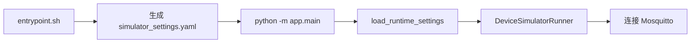
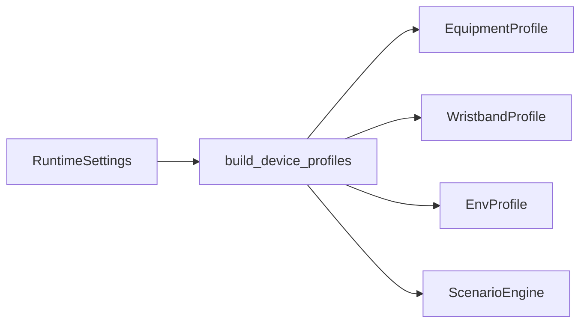
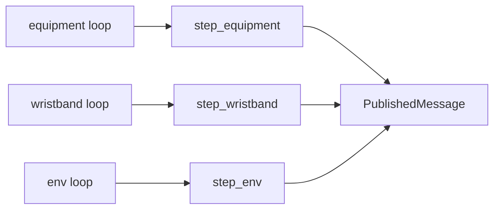
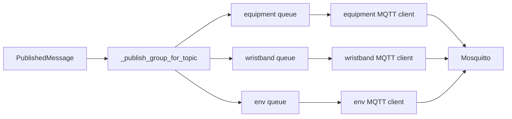
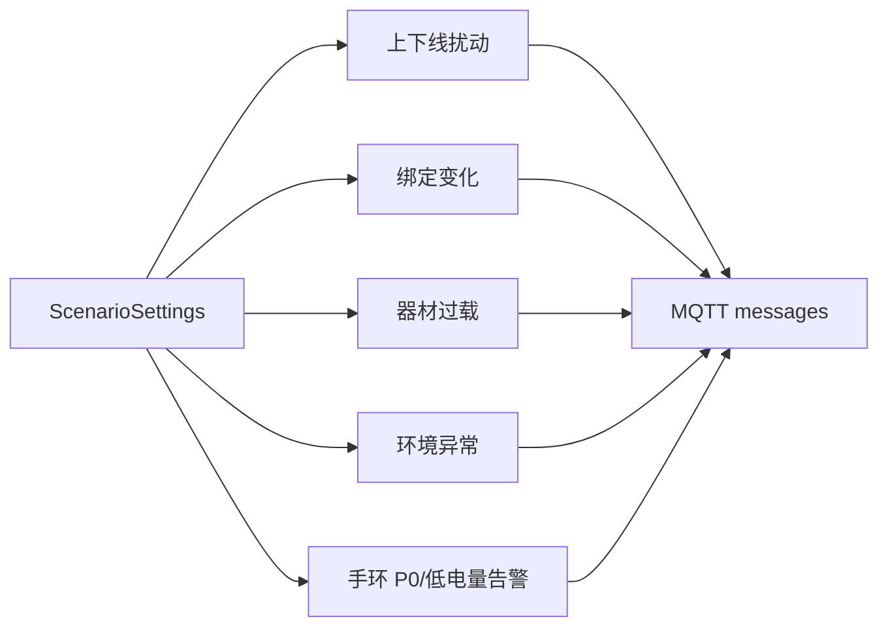

# gateway device_simulator

## 1. 简介

`gateway/device_simulator` 是网关侧 MQTT 设备模拟器。它不提供 HTTP API，主要作用是持续向 Mosquitto 发布虚拟器材、手环和环境节点消息，用于网关、后台、网页和运维链路联调。

核心作用：

- 生成固定数量的器材、手环和环境节点画像。
- 按配置的时间间隔持续推进随机场景。
- 发布 `telemetry`、`status`、`binding` 和 `alert` MQTT 消息。
- 模拟设备上下线、手环绑定变化、器材过载、低电量、P0 告警和环境异常。
- 使用设备类型分组发布队列，避免高频手环消息阻塞低频环境消息。

## 2. 依赖

Python 项目配置位于 `gateway/device_simulator/pyproject.toml`。

运行要求：

- Python：`>=3.13,<3.15`
- 包版本：`1.0.0rc1`

运行依赖：

| 依赖 | 当前版本 | 用途 |
| --- | --- | --- |
| `aiomqtt` | `2.5.1` | 连接 Mosquitto 并发布 MQTT 消息。 |
| `pydantic` | `2.13.3` | 校验运行时配置。 |
| `PyYAML` | `6.0.3` | 读取 YAML 配置文件。 |

开发依赖：

| 依赖 | 当前版本 | 用途 |
| --- | --- | --- |
| `pytest` | `9.0.3` | 单元测试。 |

构建依赖：

| 依赖 | 当前约束 | 用途 |
| --- | --- | --- |
| `setuptools` | `>=82.0.1` | Python 包构建。 |
| `wheel` | `>=0.47.0` | wheel 包构建。 |

运行时基础设施：

- Mosquitto：模拟器唯一外部运行依赖，接收模拟 MQTT 消息。
- edge_processor：通常作为模拟数据消费者，但不是模拟器启动的硬依赖。

## 3. 结构

```text
gateway/device_simulator/
├── app/
│   ├── device_profiles.py
│   ├── main.py
│   ├── models.py
│   ├── mqtt_client.py
│   ├── runner.py
│   ├── scenario_engine.py
│   └── settings.py
├── tests/
│   └── unit/
│       ├── test_device_profiles.py
│       ├── test_runner.py
│       └── test_settings.py
├── pyproject.toml
└── README.md
```

关键职责：

| 路径 | 作用 |
| --- | --- |
| `app/main.py` | 命令行入口，加载配置并启动 runner。 |
| `app/settings.py` | 定义 MQTT、间隔、场景配置并读取 YAML。 |
| `app/models.py` | 定义设备画像、运行消息和设备身份数据结构。 |
| `app/device_profiles.py` | 根据配置生成器材、手环、环境节点画像。 |
| `app/scenario_engine.py` | 推进随机场景并生成待发布 MQTT 消息。 |
| `app/mqtt_client.py` | 封装 aiomqtt JSON 发布逻辑。 |
| `app/runner.py` | 维护设备循环、分组队列和 MQTT 发布任务。 |
| `tests/unit/` | 覆盖画像生成、topic 分组路由和配置读取。 |

## 4. 功能

- 默认生成 10 台器材、10 个手环、10 个环境节点。
- 器材默认每 1000 ms 发布一次遥测。
- 手环默认每 500 ms 发布一次遥测。
- 环境节点默认每 5000 ms 发布一次遥测。
- 状态消息默认至少每 15 s 发送一次，也会在状态变化时立即发送。
- 每个设备启动前有确定性 jitter，避免所有设备同时打点。
- 器材、手环、环境节点分别使用独立 MQTT client 和发布队列。
- 模拟器只发布 MQTT 消息，不订阅 MQTT，也不暴露 HTTP / WebSocket API。

## 5. MQTT 输出

### 5.1 主题规则

模拟器生成的 topic 使用统一结构：

```text
gym/{gym_id}/{device_type}/{device_id}/{action}
```

字段说明：

| 字段 | 说明 |
| --- | --- |
| `gym_id` | 场馆 ID，默认 `gym-gz-01`。 |
| `device_type` | 设备类型，实际输出为 `equipment`、`wristband`、`env`。 |
| `device_id` | 设备 ID，例如 `eq-001`、`wb-001`、`env-001`。 |
| `action` | 消息动作，实际输出为 `telemetry`、`status`、`binding`、`alert`。 |

发布参数来自 `mqtt.qos` 和每条消息自身的 `retain` 字段：

| 消息类型 | QoS | Retain |
| --- | --- | --- |
| `telemetry` | `settings.mqtt.qos` | `false` |
| `alert` | `settings.mqtt.qos` | `false` |
| `binding` | `settings.mqtt.qos` | `false` |
| `status` | `settings.mqtt.qos` | `true` |

### 5.2 发布清单

实际代码生成的 topic 清单如下：

| 主题 | 来源方法 | 说明 |
| --- | --- | --- |
| `gym/{gym_id}/equipment/{device_id}/telemetry` | `step_equipment` | 器材功率、次数、角度、电压电流等遥测。 |
| `gym/{gym_id}/equipment/{device_id}/status` | `step_equipment` | 器材在线、离线、活跃、空闲状态。 |
| `gym/{gym_id}/wristband/{device_id}/telemetry` | `step_wristband` | 手环心率、步数、电量、IMU、当前绑定器材等遥测。 |
| `gym/{gym_id}/wristband/{device_id}/status` | `step_wristband` | 手环在线/离线状态。 |
| `gym/{gym_id}/wristband/{device_id}/binding` | `step_wristband` | 手环绑定或解绑器材事件。 |
| `gym/{gym_id}/wristband/{device_id}/alert` | `step_wristband` | 手环 P0 告警和低电量告警。 |
| `gym/{gym_id}/env/{device_id}/telemetry` | `step_env` | 环境温湿度、照度、CO2、颗粒物、Wi-Fi 信号。 |
| `gym/{gym_id}/env/{device_id}/status` | `step_env` | 环境节点在线/离线状态。 |

注意：当前模拟器不会主动发布 `equipment/alert` 或 `env/alert`。器材过载和环境异常通过遥测字段体现，由 `edge_processor` 的规则引擎消费后生成对应告警。当前模拟器器材遥测不会输出 `rated_power_w`，因此只靠模拟器默认数据不会触发 `EQ_OVERLOAD`。

### 5.3 器材消息

器材状态 topic：

```text
gym/{gym_id}/equipment/{device_id}/status
```

状态 payload：

```json
{
  "ts": 1712640000,
  "device_id": "eq-001",
  "online": true,
  "status": "active",
  "firmware_version": "sim-equipment-1.0.0",
  "ip": "192.168.10.21"
}
```

`status` 实际取值：

| 值 | 说明 |
| --- | --- |
| `offline` | 模拟设备离线。 |
| `active` | 模拟器材正在运动/工作。 |
| `idle` | 模拟器材在线但空闲。 |

器材遥测 topic：

```text
gym/{gym_id}/equipment/{device_id}/telemetry
```

遥测 payload：

```json
{
  "ts": 1712640000,
  "device_id": "eq-001",
  "status": "active",
  "rep_count": 8,
  "power_w": 320.5,
  "energy_wh": 0.382,
  "axis_angle": 48.2,
  "voltage_v": 220.8,
  "current_ma": 1451.54
}
```

字段来源：

| 字段 | 说明 |
| --- | --- |
| `rep_count` | 模拟动作次数，设备活跃时递增。 |
| `power_w` | 当前功率。过载场景下会高于额定功率。 |
| `energy_wh` | 按功率和发送间隔累计的电量。 |
| `axis_angle` | 模拟器材轴角度，活跃时范围更大。 |
| `voltage_v` | 模拟电压。 |
| `current_ma` | 由功率和电压推导的电流。 |

### 5.4 手环消息

手环状态 topic：

```text
gym/{gym_id}/wristband/{device_id}/status
```

状态 payload：

```json
{
  "ts": 1712640000,
  "device_id": "wb-001",
  "online": true,
  "status": "online",
  "firmware_version": "sim-wristband-1.0.0",
  "ip": "192.168.20.21"
}
```

手环遥测 topic：

```text
gym/{gym_id}/wristband/{device_id}/telemetry
```

遥测 payload：

```json
{
  "ts": 1712640000,
  "device_id": "wb-001",
  "heart_rate": 118,
  "step_count": 1024,
  "battery_pct": 95,
  "accel": {
    "x": 12,
    "y": -980,
    "z": 43
  },
  "gyro": {
    "x": 2,
    "y": -1,
    "z": 4
  },
  "flags": 1,
  "current_equipment_id": "eq-001",
  "relayed_by": "eq-001"
}
```

字段说明：

| 字段 | 说明 |
| --- | --- |
| `heart_rate` | 模拟心率。绑定器材活跃时基线更高。 |
| `step_count` | 模拟步数。绑定活跃器材时增长更快。 |
| `battery_pct` | 模拟电量，随时间缓慢降低。 |
| `accel` | 三轴加速度整数采样。 |
| `gyro` | 三轴陀螺仪整数采样。 |
| `flags` | 模拟状态标志位，当前随机取 `0..3`。 |
| `current_equipment_id` | 当前绑定器材 ID，未绑定时为 `null`。 |
| `relayed_by` | 当前有绑定器材时才出现，值等于绑定器材 ID。 |

### 5.5 环境消息

环境状态 topic：

```text
gym/{gym_id}/env/{device_id}/status
```

状态 payload：

```json
{
  "ts": 1712640000,
  "device_id": "env-001",
  "online": true,
  "status": "online",
  "firmware_version": "sim-env-1.0.0",
  "ip": "192.168.30.21"
}
```

环境遥测 topic：

```text
gym/{gym_id}/env/{device_id}/telemetry
```

遥测 payload：

```json
{
  "ts": 1712640000,
  "node_id": "env-001",
  "temperature": 26.2,
  "humidity": 58.4,
  "lux": 388.1,
  "co2_ppm": 960,
  "pm1_0": 12,
  "pm2_5": 24,
  "pm10": 39,
  "wifi_rssi": -56
}
```

字段说明：

| 字段 | 说明 |
| --- | --- |
| `node_id` | 环境节点 ID。注意当前代码这里使用 `node_id`，不是 `device_id`。 |
| `temperature` | 温度，环境异常时可能升高到 `35.5..39.5`。 |
| `humidity` | 湿度。 |
| `lux` | 照度。 |
| `co2_ppm` | CO2 浓度，CO2 异常时可能升高到 `1100..1800`。 |
| `pm1_0` | PM1.0。 |
| `pm2_5` | PM2.5，颗粒物异常时可能升高到 `82..150`。 |
| `pm10` | PM10。 |
| `wifi_rssi` | Wi-Fi 信号强度。 |

### 5.6 状态消息

状态消息由三类设备共享 `_build_status_payload` 生成。

共同字段：

| 字段 | 说明 |
| --- | --- |
| `ts` | 当前 Unix 秒级时间戳。 |
| `device_id` | 设备 ID。 |
| `online` | 是否在线。 |
| `status` | 状态文本。 |
| `firmware_version` | 模拟固件版本。 |
| `ip` | 模拟 IP 地址。 |

发送时机：

- 首次 step 一定发送。
- `online` 或 `status` 文本变化时发送。
- 距离上次状态发送达到 `intervals.status_interval_s` 时发送。

### 5.7 告警消息

当前只有手环会由模拟器直接发布 `alert`。

低电量告警：

```json
{
  "ts": 1712640000,
  "device_id": "wb-001",
  "priority": "P1",
  "level": "warning",
  "code": "BATTERY_LOW",
  "message": "手环电量过低：9%",
  "value": 9,
  "threshold": 10
}
```

P0 告警会按 `scenario.p0_alert_ratio` 随机生成，`code` 从以下值中选择：

| code | 示例含义 |
| --- | --- |
| `HR_HIGH` | 心率过高。 |
| `HR_LOW` | 心率过低。 |
| `FALL_DETECTED` | 检测到跌倒事件。 |

P0 告警示例：

```json
{
  "ts": 1712640000,
  "device_id": "wb-001",
  "priority": "P0",
  "level": "critical",
  "code": "HR_HIGH",
  "message": "心率过高：182 bpm，持续 35 s",
  "value": 182,
  "threshold": 180
}
```

### 5.8 绑定消息

绑定消息只由手环生成。

Topic：

```text
gym/{gym_id}/wristband/{device_id}/binding
```

绑定示例：

```json
{
  "ts": 1712640000,
  "wristband_id": "wb-001",
  "equipment_id": "eq-001",
  "gym_id": "gym-gz-01",
  "action": "bind",
  "reason": "ble_connected"
}
```

解绑示例：

```json
{
  "ts": 1712640060,
  "wristband_id": "wb-001",
  "equipment_id": "eq-001",
  "gym_id": "gym-gz-01",
  "action": "unbind",
  "reason": "idle_timeout"
}
```

实际 `reason`：

| action | reason | 触发场景 |
| --- | --- | --- |
| `bind` | `ble_connected` | 手环选择到新的在线器材。 |
| `unbind` | `idle_timeout` | 手环在线状态下切换或取消绑定。 |
| `unbind` | `ble_disconnected` | 手环离线时解除原有绑定。 |

### 5.9 示例载荷

一次典型启动后，单个设备可能先发送 retained 状态，再发送遥测：

```text
gym/gym-gz-01/equipment/eq-001/status
gym/gym-gz-01/equipment/eq-001/telemetry
gym/gym-gz-01/wristband/wb-001/status
gym/gym-gz-01/wristband/wb-001/telemetry
gym/gym-gz-01/env/env-001/status
gym/gym-gz-01/env/env-001/telemetry
```

模拟器不会给 payload 自动添加 `gateway_received_ts`。该字段由 `edge_processor` 收到 MQTT 消息后补充。

## 6. 配置

### 6.1 配置文件

运行时配置默认路径：

```text
/runtime/config/device_simulator/simulator_settings.yaml
```

容器启动时，如果该文件不存在，`entrypoint.sh` 会从以下模板复制：

```text
deployment/gateway/device_simulator/defaults/default_simulator_settings.yaml
```

### 6.2 MQTT 配置

默认配置：

```yaml
mqtt:
  host: mosquitto
  port: 1883
  username: admin
  password: admin123
  client_id: device-simulator
  keepalive_s: 60
  qos: 1
  publish_queue_size: 4096
```

说明：

| 字段 | 说明 |
| --- | --- |
| `host` | MQTT Broker 主机。 |
| `port` | MQTT Broker 端口。 |
| `username` | MQTT 用户名。 |
| `password` | MQTT 密码。 |
| `client_id` | MQTT client ID 前缀。实际会追加 `equipment`、`wristband`、`env` 后缀。 |
| `keepalive_s` | MQTT keepalive 秒数。 |
| `qos` | 发布 QoS，限制为 `0..2`。 |
| `publish_queue_size` | 每个发布分组的队列长度，限制为 `128..65536`。 |

### 6.3 间隔配置

默认配置：

```yaml
intervals:
  equipment_telemetry_ms: 1000
  wristband_telemetry_ms: 500
  env_telemetry_ms: 5000
  status_interval_s: 15
  startup_jitter_ms: 1500
```

说明：

| 字段 | 说明 |
| --- | --- |
| `equipment_telemetry_ms` | 每台器材 step 间隔。 |
| `wristband_telemetry_ms` | 每个手环 step 间隔。 |
| `env_telemetry_ms` | 每个环境节点 step 间隔。 |
| `status_interval_s` | 状态消息周期性刷新间隔。 |
| `startup_jitter_ms` | 启动抖动窗口，按设备 ID 确定性计算。 |

### 6.4 场景配置

默认配置：

```yaml
scenario:
  equipment_count: 10
  wristband_count: 10
  env_count: 10
  random_seed: 20260416
  offline_ratio: 0.015
  p0_alert_ratio: 0.01
  battery_low_ratio: 0.003
  equipment_overload_ratio: 0.04
  env_anomaly_ratio: 0.06
  bind_change_ratio: 0.02
```

说明：

| 字段 | 说明 |
| --- | --- |
| `equipment_count` | 生成器材数量，最小为 `1`。 |
| `wristband_count` | 生成手环数量，最小为 `1`。 |
| `env_count` | 生成环境节点数量，最小为 `0`。 |
| `random_seed` | 随机种子。相同配置下场景扰动可复现。 |
| `offline_ratio` | 设备进入离线状态的基础概率。 |
| `p0_alert_ratio` | 手环生成 P0 告警的概率。 |
| `battery_low_ratio` | 低电量告警已发送后再次发送的概率。 |
| `equipment_overload_ratio` | 器材进入过载 tick 的概率。 |
| `env_anomaly_ratio` | 环境节点进入异常 tick 的概率。 |
| `bind_change_ratio` | 手环切换绑定器材的概率。 |

### 6.5 默认配置

完整默认配置见：

```text
deployment/gateway/device_simulator/defaults/default_simulator_settings.yaml
```

当前代码不读取环境变量覆盖模拟器配置；需要修改运行参数时，应编辑运行时 YAML 或替换默认模板。

## 7. 数据流

### 7.1 启动流程



### 7.2 画像生成



画像规则：

- 器材 ID：`eq-001` 起递增。
- 手环 ID：`wb-001` 起递增。
- 环境节点 ID：`env-001` 起递增。
- 手环默认按序绑定同序号器材，器材数量不足时初始未绑定。

### 7.3 场景推进



每个 step 使用当前 Unix 秒级时间戳生成 payload，返回零到多条 `PublishedMessage`。

### 7.4 分组发布



分组依据是 topic 第三段 `device_type`。

### 7.5 异常模拟



当前异常主要通过概率扰动产生。适合联调和演示，不适合需要完全固定脚本的精确回归。

## 8. 测试

### 8.1 测试结构

```text
gateway/device_simulator/tests/unit/
├── test_device_profiles.py
├── test_runner.py
└── test_settings.py
```

### 8.2 单元测试

| 文件 | 作用 |
| --- | --- |
| `test_device_profiles.py` | 验证画像数量、设备 ID 格式和手环默认绑定关系。 |
| `test_runner.py` | 验证 MQTT topic 根据设备类型路由到对应发布分组。 |
| `test_settings.py` | 验证 YAML 配置能正确加载到运行时配置。 |

### 8.3 运行方式

从仓库根目录使用容器运行单元测试：

```bash
docker run --rm \
  -v "$PWD:/workspace" \
  -w /workspace/gateway/device_simulator \
  python:3.13-slim \
  sh -lc "pip install --no-cache-dir -i https://pypi.tuna.tsinghua.edu.cn/simple .[dev] >/tmp/pip.log && pytest tests/unit -q"
```

Apple `container` 环境可使用同等命令，把 `docker run --rm` 替换为 `container run --remove`。

### 8.4 覆盖边界

当前单元测试覆盖配置、画像和发布路由。

当前不在单元测试中覆盖：

- 真实 Mosquitto 连接和网络异常。
- 长时间运行下的概率分布。
- edge_processor、backend、web 的整栈消费链路。
- TLS、认证失败和弱网模拟。

这些场景应通过 `deployment/` 下联调脚本或后续场景测试补充。

## 9. 镜像

### 9.1 构建文件

镜像文件：

```text
deployment/gateway/device_simulator/Dockerfile
```

作用：

- 使用 `python:3.13-slim` 作为默认基础镜像。
- 设置 `/opt/motion_sense/gateway/device_simulator` 为工作目录。
- 复制 `gateway/device_simulator/` 源码。
- 复制 `deployment/gateway/device_simulator/defaults/` 默认配置。
- 安装当前 Python 包。
- 使用 `/entrypoint.sh` 启动服务。

可用构建参数：

| 参数 | 默认值 | 说明 |
| --- | --- | --- |
| `PYTHON_BASE` | `python:3.13-slim` | Python 基础镜像。 |
| `PIP_INDEX_URL` | `https://pypi.tuna.tsinghua.edu.cn/simple` | pip 镜像源。 |

### 9.2 入口脚本

入口脚本：

```text
deployment/gateway/device_simulator/entrypoint.sh
```

作用：

- 创建 `/runtime/config/device_simulator`。
- 首次运行时生成 `/runtime/config/device_simulator/simulator_settings.yaml`。
- 执行：

```bash
python -m app.main
```

### 9.3 配置模板

默认模板：

```text
deployment/gateway/device_simulator/defaults/default_simulator_settings.yaml
```

生成目标：

```text
/runtime/config/device_simulator/simulator_settings.yaml
```

### 9.4 运行挂载

模拟器容器至少需要挂载运行时配置目录：

| 宿主路径 | 容器路径 | 作用 |
| --- | --- | --- |
| `deployment/runtime/config` | `/runtime/config` | 保存 `device_simulator/simulator_settings.yaml`。 |

还需要确保容器能访问目标 Mosquitto：

- 默认主机名：`mosquitto`
- 默认端口：`1883`
- 默认用户名：`admin`
- 默认密码：`admin123`

### 9.5 联调方式

`device_simulator` 当前不在 gateway Linux Compose 正式栈中默认启动，主要用于联调、回归和数据打点。

典型用法：

1. 先启动 Mosquitto、InfluxDB、edge_processor 和 backend。
2. 将模拟器容器加入同一容器网络。
3. 挂载 `deployment/runtime/config` 到 `/runtime/config`。
4. 确认 `simulator_settings.yaml` 中的 MQTT 地址和账号匹配目标 Broker。
5. 启动模拟器后观察 edge_processor 是否收到对应 MQTT 消息。

相关部署资产：

| 路径 | 作用 |
| --- | --- |
| `deployment/gateway/device_simulator/Dockerfile` | 构建模拟器镜像。 |
| `deployment/gateway/device_simulator/entrypoint.sh` | 初始化配置并启动模拟器。 |
| `deployment/gateway/device_simulator/defaults/default_simulator_settings.yaml` | 默认配置模板。 |
| `deployment/gateway/container/publish_sample_telemetry.sh` | 发布单条样例遥测，适合快速验证 MQTT 链路。 |

## 10. 改进方向

- 增加可控场景脚本，减少对概率扰动的依赖。
- 增加可回放数据样本集，用于稳定回归测试。
- 增加真实 MQTT 连接层集成测试。
- 增加 TLS、认证异常、断网、重连和弱网模拟。
- 补充更多器材类型、手环指标和环境指标。
- 如后续真实设备字段发生变化，优先按代码消费链路同步更新模拟器输出、edge_processor 规则和模块 README。

## 11. See Also

- `README.md`
- `AGENTS.md`
- `design/04-网关端.md`
- `design/07-通讯接口定义.md`
- `design/08-开发排期.md`
- `deployment/gateway/README.md`
- `deployment/gateway/container/README.md`
- `deployment/gateway/device_simulator/Dockerfile`
- `deployment/gateway/device_simulator/defaults/default_simulator_settings.yaml`
