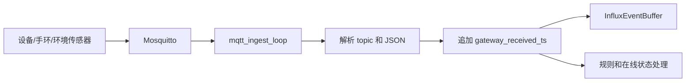
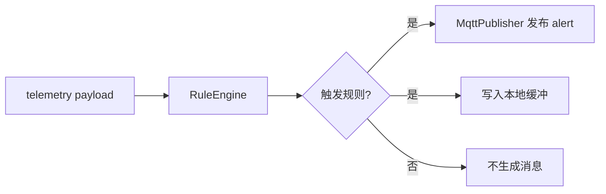
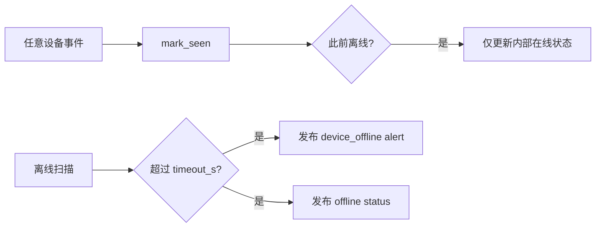
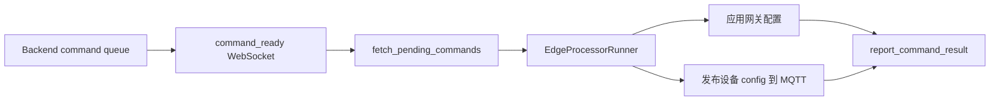
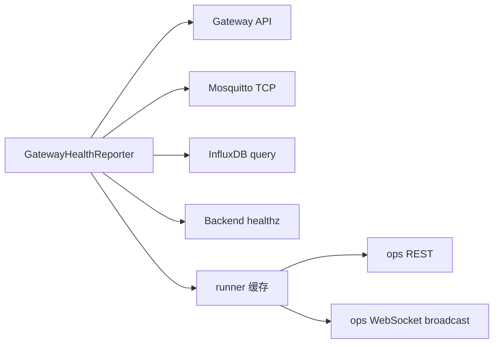

# gateway edge_processor

## 1. 简介

`gateway/edge_processor` 是网关侧异步处理服务。它连接本地 MQTT Broker、InfluxDB 3 Core 和后台服务，负责把设备侧消息转成后台可消费的事件流。

核心作用：

- 订阅手环、器械和环境设备 MQTT 主题。
- 给入站消息补充网关接收时间，并写入本地 InfluxDB 缓冲。
- 按批量窗口、阈值和兜底定时策略上传后台。
- 根据本地规则生成告警和设备离线状态。
- 接收后台命令通知，将配置命令应用到网关或转发到设备。
- 对外提供健康检查、运维状态和运维 WebSocket 推送。

## 2. 依赖

Python 项目配置位于 `gateway/edge_processor/pyproject.toml`。

运行要求：

- Python：`>=3.13,<3.15`
- 包版本：`1.0.0rc1`

运行依赖：

| 依赖 | 当前版本 | 用途 |
| --- | --- | --- |
| `aiomqtt` | `2.5.1` | MQTT 订阅与发布 |
| `fastapi` | `0.136.1` | HTTP / WebSocket API |
| `httpx` | `0.28.1` | 访问后台和 InfluxDB HTTP API |
| `pydantic` | `2.13.3` | 配置和数据模型校验 |
| `PyYAML` | `6.0.3` | 读取 YAML 配置和规则文件 |
| `uvicorn[standard]` | `0.46.0` | 运行 FastAPI 服务 |

开发依赖：

| 依赖 | 当前版本 | 用途 |
| --- | --- | --- |
| `pytest` | `9.0.3` | 单元测试 |

构建依赖：

| 依赖 | 当前约束 | 用途 |
| --- | --- | --- |
| `setuptools` | `>=82.0.1` | Python 包构建 |
| `wheel` | `>=0.47.0` | wheel 包构建 |

运行时基础设施：

- Mosquitto：本地 MQTT Broker。
- InfluxDB 3 Core：网关本地事件缓冲和补发队列。
- Backend API：后台入库、命令队列和健康检查。
- 可选 Ops Observer：通过运维接口采集网关状态。

## 3. 结构

```text
gateway/edge_processor/
├── app/
│   ├── api/
│   │   ├── health.py
│   │   └── ops.py
│   ├── models/
│   │   ├── device_command.py
│   │   ├── ingest_item.py
│   │   ├── ops.py
│   │   └── system_health.py
│   ├── services/
│   │   ├── backend_client.py
│   │   ├── batch_uploader.py
│   │   ├── device_presence.py
│   │   ├── gateway_command_channel.py
│   │   ├── health_reporter.py
│   │   ├── influx_event_buffer.py
│   │   ├── mqtt_ingest.py
│   │   ├── mqtt_publisher.py
│   │   ├── ops_websocket_manager.py
│   │   ├── rule_engine.py
│   │   ├── runner.py
│   │   └── runtime_config.py
│   ├── utils/
│   │   └── topic_parser.py
│   ├── main.py
│   └── settings.py
├── tests/
│   └── unit/
├── pyproject.toml
└── README.md
```

关键职责：

| 路径 | 作用 |
| --- | --- |
| `app/main.py` | 创建 FastAPI 应用，绑定 runner 生命周期。 |
| `app/settings.py` | 读取 YAML、环境变量和 secret 文件，生成运行配置。 |
| `app/api/health.py` | 提供轻量健康检查。 |
| `app/api/ops.py` | 提供运维 REST 和 WebSocket 接口。 |
| `app/services/mqtt_ingest.py` | 订阅 MQTT，解析 topic，补充网关接收时间。 |
| `app/services/influx_event_buffer.py` | 写入 InfluxDB 本地缓冲，查询待补发事件，记录已投递事件。 |
| `app/services/batch_uploader.py` | 从本地缓冲批量上传后台。 |
| `app/services/rule_engine.py` | 加载规则，评估遥测数据，生成本地告警。 |
| `app/services/device_presence.py` | 维护设备在线状态，识别离线和恢复。 |
| `app/services/mqtt_publisher.py` | 发布本地生成的告警、状态和设备配置。 |
| `app/services/backend_client.py` | 调用后台入库和命令结果接口。 |
| `app/services/gateway_command_channel.py` | 连接后台命令 WebSocket，接收 `command_ready`。 |
| `app/services/health_reporter.py` | 采集网关 API、MQTT、InfluxDB、Backend 等组件健康状态。 |
| `app/services/runtime_config.py` | 应用后台命令通道下发的网关动态配置并触发规则热重载。 |
| `app/services/runner.py` | 编排所有后台任务、计数器、规则处理和命令执行。 |
| `app/utils/topic_parser.py` | 解析 `gym/{gym_id}/{device_type}/{device_id}/{action}` 主题。 |

## 4. 功能

- MQTT 入站：订阅设备消息，解析为 `IngestItem`。
- 本地缓冲：事件先写入 InfluxDB，后台上传成功后再记录投递状态。
- 批量上传：支持最小聚合窗口、触发阈值和定时兜底回放。
- 规则告警：支持设备过载、CO2、PM2.5、温度和设备离线规则。
- 动态配置：后台命令通道可更新规则文件并触发热重载。
- 设备状态：设备离线时发布 retained `status`；恢复在线状态由设备自身发布。
- 后台命令：通过 WebSocket 低延迟唤醒，同时保留 pending 轮询兜底。
- 运维观测：提供健康摘要、组件状态、运行计数器和 WebSocket 快照。

## 5. MQTT 接口

### 5.1 主题规则

所有业务 MQTT topic 使用五段结构：

```text
gym/{gym_id}/{device_type}/{device_id}/{action}
```

字段说明：

| 字段 | 说明 |
| --- | --- |
| `gym_id` | 场馆 ID，例如 `gym-gz-01`。 |
| `device_type` | 设备类型，设备消息使用 `wristband`、`equipment`、`env`。 |
| `device_id` | 设备 ID。 |
| `action` | 消息动作，例如 `telemetry`、`binding`、`alert`、`status`、`config`。 |

入站 payload 必须是 JSON object。服务接收后会追加：

```json
{
  "gateway_received_ts": 1712640009
}
```

`alert` 和 `status` 消息如果带有 `"published_by":"edge_processor"`，会被识别为本服务生成的内部消息并跳过入站处理，避免重复回环。

### 5.2 订阅清单

默认订阅清单来自 `RuntimeSettings.mqtt.topic_patterns` 和 `deployment/gateway/edge_processor/defaults/default_app_settings.yaml`。

| 主题 | 动作 | 处理方式 |
| --- | --- | --- |
| `gym/+/wristband/+/telemetry` | 手环遥测 | 写入本地缓冲并上传后台。 |
| `gym/+/wristband/+/binding` | 手环绑定 | 写入本地缓冲并上传后台。 |
| `gym/+/wristband/+/alert` | 手环告警 | 写入本地缓冲并上传后台。 |
| `gym/+/wristband/+/status` | 手环状态 | 写入本地缓冲并上传后台。 |
| `gym/+/equipment/+/telemetry` | 器械遥测 | 写入本地缓冲，参与规则判断和设备在线判断。 |
| `gym/+/equipment/+/alert` | 器械告警 | 写入本地缓冲并上传后台。 |
| `gym/+/equipment/+/status` | 器械状态 | 写入本地缓冲并上传后台。 |
| `gym/+/env/+/telemetry` | 环境遥测 | 写入本地缓冲，参与规则判断和设备在线判断。 |
| `gym/+/env/+/alert` | 环境告警 | 写入本地缓冲并上传后台。 |
| `gym/+/env/+/status` | 环境状态 | 写入本地缓冲并上传后台。 |

### 5.3 遥测上报

适用主题：

```text
gym/{gym_id}/wristband/{device_id}/telemetry
gym/{gym_id}/equipment/{device_id}/telemetry
gym/{gym_id}/env/{device_id}/telemetry
```

手环示例：

```json
{
  "ts": 1712640000,
  "heart_rate": 118,
  "step_count": 1024,
  "battery_pct": 95,
  "current_equipment_id": "eq-001",
  "relayed_by": "eq-001",
  "accel": [12, -980, 43],
  "gyro": [2, -1, 4],
  "flags": 0
}
```

器械示例：

```json
{
  "ts": 1712640000,
  "rep_count": 8,
  "power_w": 320.5,
  "rated_power_w": 500.0,
  "energy_wh": 0.382,
  "axis_angle": 48.2,
  "voltage_v": 220.8,
  "current_ma": 1451.54
}
```

环境示例：

```json
{
  "ts": 1712640000,
  "temperature": 26.2,
  "humidity": 58.4,
  "co2_ppm": 960,
  "pm2_5": 24,
  "lux": 388.1
}
```

规则引擎当前识别字段：

| 规则 | 设备类型 | 字段 |
| --- | --- | --- |
| `EQ_OVERLOAD` | `equipment` | `power_w`、`rated_power_w` |
| `CO2_HIGH` | `env` | `co2_ppm` |
| `CO2_CRITICAL` | `env` | `co2_ppm` |
| `PM25_HIGH` | `env` | `pm2_5` |
| `TEMP_HIGH` | `env` | `temperature` |
| `DEVICE_OFFLINE` | `wristband`、`equipment`、`env` | 通过网关接收时间判断静默超时。 |

### 5.4 绑定上报

适用主题：

```text
gym/{gym_id}/wristband/{device_id}/binding
```

示例：

```json
{
  "ts": 1712640000,
  "equipment_id": "eq-001",
  "bound": true,
  "reason": "ble_connected"
}
```

处理方式：作为 `kind="binding"` 的入站事件写入本地缓冲并上传后台。

### 5.5 告警上报

适用主题：

```text
gym/{gym_id}/wristband/{device_id}/alert
gym/{gym_id}/equipment/{device_id}/alert
gym/{gym_id}/env/{device_id}/alert
```

设备主动告警示例：

```json
{
  "ts": 1712640000,
  "priority": "P1",
  "level": "warning",
  "alert_type": "overload",
  "message": "equipment overload",
  "value": 520.0,
  "threshold": 500.0
}
```

处理方式：作为 `kind="alert"` 的入站事件写入本地缓冲并上传后台。若 `published_by` 为 `edge_processor`，该消息会被忽略。

### 5.6 状态上报

适用主题：

```text
gym/{gym_id}/wristband/{device_id}/status
gym/{gym_id}/equipment/{device_id}/status
gym/{gym_id}/env/{device_id}/status
```

示例：

```json
{
  "ts": 1712640000,
  "status": "active",
  "firmware_version": "eq-fw-1.2.0",
  "mac": "02:00:00:00:00:01"
}
```

处理方式：作为 `kind="status"` 的入站事件写入本地缓冲并上传后台。若 `published_by` 为 `edge_processor`，该消息会被忽略。

### 5.7 本地生成消息

edge_processor 会根据规则和设备离线状态发布本地消息，并同时写入本地缓冲等待上传后台。设备恢复在线状态由设备自身发布 retained `status`，网关不生成恢复在线状态。

规则告警主题：

```text
gym/{gym_id}/{device_type}/{device_id}/alert
```

规则告警示例：

```json
{
  "ts": 1712640060,
  "priority": "P1",
  "level": "warning",
  "alert_type": "co2_high",
  "message": "CO2_HIGH triggered: co2_ppm=1120.00, threshold=1000.00",
  "value": 1120,
  "threshold": 1000,
  "published_by": "edge_processor"
}
```

离线告警示例：

```json
{
  "ts": 1712640090,
  "priority": "P1",
  "level": "warning",
  "alert_type": "device_offline",
  "message": "device offline: no heartbeat for 30s",
  "published_by": "edge_processor"
}
```

状态主题：

```text
gym/{gym_id}/{device_type}/{device_id}/status
```

状态示例：

```json
{
  "ts": 1712640090,
  "status": "offline",
  "firmware_version": "edge-generated",
  "mac": "00:00:00:00:00:00",
  "published_by": "edge_processor"
}
```

发布参数：

| 消息 | QoS | Retain |
| --- | --- | --- |
| 规则告警 | `settings.mqtt.qos` | `false` |
| 离线告警 | `settings.mqtt.qos` | `false` |
| 离线状态 | `settings.mqtt.qos` | `true` |

### 5.8 示例载荷

所有入站事件最终上传后台前会变成统一结构：

```json
{
  "kind": "telemetry",
  "topic": "gym/gym-gz-01/equipment/eq-001/telemetry",
  "payload": {
    "ts": 1712640000,
    "power_w": 320.5,
    "rated_power_w": 500.0,
    "gateway_received_ts": 1712640009
  }
}
```

批量上传时外层包为：

```json
{
  "gateway_id": "gw-001",
  "sent_at": "2026-04-26T10:00:00+00:00",
  "items": [
    {
      "kind": "telemetry",
      "topic": "gym/gym-gz-01/equipment/eq-001/telemetry",
      "payload": {
        "ts": 1712640000,
        "power_w": 320.5,
        "rated_power_w": 500.0,
        "gateway_received_ts": 1712640009
      }
    }
  ]
}
```

## 6. API 接口

### 6.1 接口总览

本服务暴露接口：

| 方法 | 路径 | 说明 | 鉴权 |
| --- | --- | --- | --- |
| `GET` | `/healthz` | 进程存活检查。 | 无 |
| `GET` | `/ops/v1/health` | 网关健康摘要。 | 可选 Bearer token |
| `GET` | `/ops/v1/health/components` | 网关组件健康列表。 | 可选 Bearer token |
| `GET` | `/ops/v1/stats` | 网关运行计数器。 | 可选 Bearer token |
| `WS` | `/ops/ws` | 运维实时快照和 ping/pong。 | 可选 query token |

本服务主动访问后台接口：

| 方法 | 路径 | 说明 |
| --- | --- | --- |
| `POST` | `/api/v1/ingest/batch` | 批量上传本地缓冲事件。 |
| `GET` | `/api/v1/gateway/{gateway_id}/commands/pending` | 拉取待执行配置命令。 |
| `POST` | `/api/v1/gateway/{gateway_id}/commands/{command_id}/result` | 回报命令执行结果。 |
| `WS` | `/api/v1/gateway/{gateway_id}/commands/ws` | 监听后台 `command_ready` 通知。 |
| `GET` | `/healthz` | 检查后台 API 健康状态。 |

### 6.2 健康检查

请求：

```bash
curl -fsS http://127.0.0.1:8080/healthz
```

响应示例：

```json
{
  "status": "ok",
  "app_name": "motion-sense-edge-processor",
  "gateway_id": "gw-001"
}
```

### 6.3 运维健康

请求：

```bash
curl -fsS -H "Authorization: Bearer ${EDGE_OPS_TOKEN}" \
  http://127.0.0.1:8080/ops/v1/health
```

响应示例：

```json
{
  "module_id": "gateway:gw-001",
  "module_type": "gateway",
  "gateway_id": "gw-001",
  "gym_id": "gym-gz-01",
  "online": true,
  "health_status": "healthy",
  "checked_at": "2026-04-26T10:00:00+00:00",
  "component_total": 5,
  "healthy_components": 5,
  "degraded_components": 0,
  "offline_components": 0
}
```

### 6.4 组件状态

请求：

```bash
curl -fsS -H "Authorization: Bearer ${EDGE_OPS_TOKEN}" \
  http://127.0.0.1:8080/ops/v1/health/components
```

响应示例：

```json
[
  {
    "component_id": "gateway_api",
    "component_type": "gateway_api",
    "display_name": "Gateway API",
    "online": true,
    "health_status": "healthy",
    "checked_at": "2026-04-26T10:00:00+00:00",
    "endpoint": "http://127.0.0.1:8080/healthz",
    "latency_ms": 3,
    "detail": null,
    "extra": {}
  }
]
```

当前健康采集覆盖：

- `gateway_api`
- `edge_processor`
- `mqtt_broker`
- `local_timeseries_db`
- `backend_api`

### 6.5 运行统计

请求：

```bash
curl -fsS -H "Authorization: Bearer ${EDGE_OPS_TOKEN}" \
  http://127.0.0.1:8080/ops/v1/stats
```

响应示例：

```json
{
  "module_id": "gateway:gw-001",
  "module_type": "gateway",
  "gateway_id": "gw-001",
  "gym_id": "gym-gz-01",
  "started_at": "2026-04-26T09:55:00+00:00",
  "uptime_s": 300,
  "active_ops_ws_connections": 1,
  "mqtt_events_received_total": 120,
  "telemetry_events_total": 100,
  "alert_events_total": 3,
  "binding_events_total": 2,
  "status_events_total": 15,
  "generated_alerts_total": 4,
  "generated_status_total": 2,
  "command_polls_total": 20,
  "commands_executed_total": 1,
  "command_failures_total": 0,
  "batch_upload_success_total": 12,
  "batch_upload_failure_total": 0,
  "last_batch_size": 10,
  "last_batch_uploaded_at": "2026-04-26T10:00:00+00:00",
  "last_batch_error": null,
  "health_check_success_total": 20,
  "health_check_failure_total": 0,
  "last_health_checked_at": "2026-04-26T10:00:00+00:00",
  "last_health_error": null,
  "last_known_health_status": "healthy",
  "batch_interval_s": 10,
  "command_poll_interval_s": 3,
  "health_interval_s": 15,
  "replay_batch_size": 500
}
```

### 6.6 实时推送

连接：

```text
ws://127.0.0.1:8080/ops/ws?token=${EDGE_OPS_TOKEN}
```

初始消息：

```json
{
  "type": "ops_snapshot",
  "data": {
    "module_id": "gateway:gw-001",
    "module_type": "gateway",
    "gateway_id": "gw-001",
    "gym_id": "gym-gz-01",
    "online": true,
    "health_status": "healthy",
    "checked_at": "2026-04-26T10:00:00+00:00",
    "component_total": 5,
    "healthy_components": 5,
    "degraded_components": 0,
    "offline_components": 0
  }
}
```

Ping 请求：

```json
{
  "type": "ping"
}
```

Pong 响应：

```json
{
  "type": "pong"
}
```

### 6.7 接口鉴权

REST 鉴权由以下配置控制：

```yaml
ops_auth:
  enforce_rest: true
  token: "..."
```

WebSocket 鉴权由以下配置控制：

```yaml
ops_auth:
  enforce_ws: true
  token: "..."
```

REST 规则：

| 场景 | 状态码 | 响应 |
| --- | --- | --- |
| 未开启鉴权 | `200` | 正常返回。 |
| 开启鉴权但未配置 token | `503` | `ops rest auth token not configured` |
| 缺少 Bearer token | `401` | `missing bearer token` |
| token 错误 | `403` | `invalid ops token` |
| token 正确 | `200` | 正常返回。 |

WebSocket 规则：

| 场景 | 关闭码 | 原因 |
| --- | --- | --- |
| 开启鉴权但未配置 token | `1011` | `ops ws auth token not configured` |
| 缺少 query token | `1008` | `missing token` |
| token 错误 | `1008` | `invalid ops token` |
| token 正确 | 接受连接 | 发送初始 `ops_snapshot`。 |

默认容器入口会从 `/runtime/secrets/edge_processor_ops_token.txt` 读取 token；如果文件不存在，会使用 `EDGE_PROCESSOR_OPS_AUTH_TOKEN` 或随机生成一个 token。

### 6.8 后台外联

后台 base URL 默认是：

```text
http://backend:8000/api/v1
```

批量入库请求：

```bash
curl -fsS -X POST http://backend:8000/api/v1/ingest/batch \
  -H 'Content-Type: application/json' \
  -d '{
    "gateway_id":"gw-001",
    "sent_at":"2026-04-26T10:00:00+00:00",
    "items":[
      {
        "kind":"telemetry",
        "topic":"gym/gym-gz-01/equipment/eq-001/telemetry",
        "payload":{"ts":1712640000,"power_w":320.5,"rated_power_w":500.0,"gateway_received_ts":1712640009}
      }
    ]
  }'
```

拉取命令请求：

```bash
curl -fsS http://backend:8000/api/v1/gateway/gw-001/commands/pending
```

拉取命令响应示例：

```json
{
  "gateway_id": "gw-001",
  "items": [
    {
      "command_id": "cmd-001",
      "gateway_id": "gw-001",
      "device_id": "env-a",
      "gym_id": "gym-gz-01",
      "device_type": "env",
      "topic": "gym/gym-gz-01/env/env-a/config",
      "qos": 1,
      "retain": false,
      "payload": {
        "telemetry_interval_s": 20,
        "co2_threshold_ppm": 1200,
        "pm25_threshold_ugm3": 75
      },
      "status": "pending",
      "attempt_count": 1,
      "max_attempts": 3,
      "retry_backoff_s": 5,
      "last_attempt_at": "2026-04-15T08:00:01Z",
      "next_retry_at": "2026-04-15T08:00:00Z",
      "leased_until": "2026-04-15T08:00:16Z",
      "expires_at": "2026-04-15T08:05:00Z",
      "created_at": "2026-04-15T08:00:00Z",
      "updated_at": "2026-04-15T08:00:00Z",
      "result_detail": null,
      "result_payload": {}
    }
  ]
}
```

回报命令结果请求：

```bash
curl -fsS -X POST http://backend:8000/api/v1/gateway/gw-001/commands/cmd-001/result \
  -H 'Content-Type: application/json' \
  -d '{
    "status":"succeeded",
    "reported_at":"2026-04-26T10:00:00+00:00",
    "detail":"forwarded to local mqtt broker",
    "result_payload":{}
  }'
```

命令通知 WebSocket：

```text
ws://backend:8000/api/v1/gateway/gw-001/commands/ws?token=${GATEWAY_COMMAND_TOKEN}
```

通知消息示例：

```json
{
  "type": "command_ready",
  "data": {
    "gateway_id": "gw-001"
  }
}
```

连接建立后会立即拉取一次 pending 命令；之后每次收到匹配当前 `gateway_id` 的 `command_ready` 都会再次拉取。

## 7. 数据流

### 7.1 遥测入站



### 7.2 批量上报


批上传触发条件：

- 达到 `batch_trigger_threshold` 时立即上传。
- 未达到阈值时等待 `batch_min_window_s` 聚合窗口。
- 没有事件通知时按 `batch_interval_s` 兜底扫描。

### 7.3 规则告警



默认规则文件：`deployment/gateway/edge_processor/defaults/default_rules.yaml`。

### 7.4 设备离线



离线判断使用网关接收时间，避免设备自身 `ts` 异常导致误判。

### 7.5 命令下发



命令通道异常时，runner 会按 `command_poll_interval_s` 继续 pending 轮询。

### 7.6 健康观测



## 8. 测试

### 8.1 测试结构

当前测试目录只保留真实可运行的单元测试：

```text
gateway/edge_processor/tests/unit/
```

`tests/contract/` 和 `tests/integration/` 已删除；对应功能已经转移到其他回归验证脚本和系统级测试路径。

### 8.2 单元测试

| 文件 | 作用 |
| --- | --- |
| `test_backend_client.py` | 验证 pending 命令拉取和命令结果回报路径。 |
| `test_batch_uploader.py` | 验证事件触发上传、定时兜底、最小窗口和阈值触发。 |
| `test_device_presence.py` | 验证设备离线、恢复和重复离线抑制。 |
| `test_health.py` | 验证 `/healthz` 返回服务和网关身份。 |
| `test_health_reporter.py` | 验证网关组件健康状态聚合。 |
| `test_influx_event_buffer.py` | 验证 InfluxDB 写入、查询、ack、缺表兼容和顺序恢复。 |
| `test_mqtt_ingest.py` | 验证 MQTT 重连、订阅、入站解析和内部消息过滤。 |
| `test_ops_api.py` | 验证运维 REST、WebSocket、ping/pong 和鉴权。 |
| `test_rule_engine.py` | 验证规则窗口、规则禁用、离线配置和时间源。 |
| `test_runner_commands.py` | 验证网关命令、设备命令和命令通道唤醒。 |
| `test_runtime_config.py` | 验证动态配置写规则文件、热重载通知和重启字段告警。 |
| `test_settings.py` | 验证 secret 文件读取和批上传配置读取。 |
| `test_topic_parser.py` | 验证 MQTT topic 解析和非法 topic 拒绝。 |

### 8.3 运行方式

从仓库根目录执行语法检查：

```bash
python3 -m compileall gateway/edge_processor/app
```

使用容器运行单元测试：

```bash
docker run --rm \
  -v "$PWD:/workspace:ro" \
  -w /tmp \
  python:3.13-slim \
  sh -lc "cp -a /workspace/gateway/edge_processor /tmp/src && cd /tmp/src && pip install --no-cache-dir -i https://pypi.tuna.tsinghua.edu.cn/simple .[dev] >/tmp/pip.log && PYTHONDONTWRITEBYTECODE=1 pytest tests/unit -q -p no:cacheprovider"
```

Apple `container` 环境可使用同等命令，把 `docker run --rm` 替换为 `container run --remove`。

### 8.4 覆盖边界

当前单元测试覆盖核心纯逻辑、HTTP 客户端 mock、MQTT fake、运维接口和规则行为。

当前不在本模块单元测试中覆盖：

- 真实 Mosquitto 网络行为。
- 真实 InfluxDB 进程和磁盘持久化。
- Backend、Ops Observer、Web 前端整栈联动。
- TLS、证书权限和生产级 ACL。

这些场景由 `deployment/` 下的容器验证脚本和整栈回归覆盖。

## 9. 镜像

### 9.1 构建文件

镜像文件：`deployment/gateway/edge_processor/Dockerfile`

作用：

- 使用 `python:3.13-slim` 作为默认基础镜像。
- 设置 `/opt/motion_sense/gateway/edge_processor` 为工作目录。
- 复制 `gateway/edge_processor/` 源码。
- 复制 `deployment/gateway/edge_processor/defaults/` 默认配置。
- 安装当前 Python 包。
- 暴露 `8080`。
- 使用 `/entrypoint.sh` 启动服务。

可用构建参数：

| 参数 | 默认值 | 说明 |
| --- | --- | --- |
| `PYTHON_BASE` | `python:3.13-slim` | Python 基础镜像。 |
| `PIP_INDEX_URL` | `https://pypi.tuna.tsinghua.edu.cn/simple` | pip 镜像源。 |

### 9.2 入口脚本

入口脚本：`deployment/gateway/edge_processor/entrypoint.sh`

作用：

- 创建 `/runtime/config/edge_processor` 和 `/runtime/secrets`。
- 首次运行时从默认模板生成：
  - `/runtime/config/edge_processor/app_settings.yaml`
  - `/runtime/config/edge_processor/logging.yaml`
  - `/runtime/config/edge_processor/rules.yaml`
- 初始化运维 token：`/runtime/secrets/edge_processor_ops_token.txt`。
- 等待或写入后台命令通道 token：`/runtime/secrets/backend_gateway_command_token.txt`。
- 最终执行：

```bash
uvicorn app.main:app --host 0.0.0.0 --port 8080
```

### 9.3 配置模板

默认模板目录：`deployment/gateway/edge_processor/defaults/`

| 文件 | 生成目标 | 作用 |
| --- | --- | --- |
| `default_app_settings.yaml` | `/runtime/config/edge_processor/app_settings.yaml` | 服务、后台、InfluxDB、MQTT、ops 鉴权默认配置。 |
| `default_logging.yaml` | `/runtime/config/edge_processor/logging.yaml` | 日志格式和 console handler。 |
| `default_rules.yaml` | `/runtime/config/edge_processor/rules.yaml` | 默认告警规则和规则全局配置。 |

主要运行时配置也可通过环境变量覆盖，常用变量包括：

| 环境变量 | 作用 |
| --- | --- |
| `EDGE_PROCESSOR_GATEWAY_ID` | 当前网关 ID。 |
| `EDGE_PROCESSOR_GYM_ID` | 当前场馆 ID。 |
| `EDGE_PROCESSOR_PORT` | 服务端口。 |
| `EDGE_PROCESSOR_LOG_LEVEL` | 日志级别。 |
| `EDGE_PROCESSOR_BATCH_INTERVAL_S` | 批上传兜底间隔。 |
| `EDGE_PROCESSOR_BATCH_MIN_WINDOW_S` | 最小聚合窗口。 |
| `EDGE_PROCESSOR_BATCH_TRIGGER_THRESHOLD` | 立即上传阈值。 |
| `EDGE_PROCESSOR_BACKEND_BASE_URL` | 后台 API base URL。 |
| `EDGE_PROCESSOR_BACKEND_COMMAND_CHANNEL_TOKEN` | 后台命令 WebSocket token。 |
| `EDGE_PROCESSOR_MQTT_HOST` | MQTT Broker 地址。 |
| `EDGE_PROCESSOR_MQTT_PORT` | MQTT Broker 端口。 |
| `EDGE_PROCESSOR_MQTT_USERNAME` | MQTT 用户名。 |
| `EDGE_PROCESSOR_MQTT_PASSWORD` | MQTT 密码。 |
| `EDGE_PROCESSOR_OPS_AUTH_ENFORCE_REST` | 是否强制 REST 运维鉴权。 |
| `EDGE_PROCESSOR_OPS_AUTH_ENFORCE_WS` | 是否强制 WebSocket 运维鉴权。 |
| `EDGE_PROCESSOR_OPS_AUTH_TOKEN` | 运维接口 token。 |

### 9.4 运行挂载

Linux Compose 中的服务定义位于 `deployment/gateway/compose/docker-compose.yaml`。

`gateway_edge_processor` 主要挂载：

| 宿主路径 | 容器路径 | 作用 |
| --- | --- | --- |
| `deployment/runtime/config` | `/runtime/config` | 配置、规则、InfluxDB token 等。 |
| `deployment/runtime/secrets` | `/runtime/secrets` | 运维 token 和后台命令通道 token。 |

服务依赖：

- `gateway_mosquitto` 健康后启动。
- `gateway_influxdb` 健康后启动。

Compose 默认强制开启：

```yaml
EDGE_PROCESSOR_OPS_AUTH_ENFORCE_REST: "true"
EDGE_PROCESSOR_OPS_AUTH_ENFORCE_WS: "true"
```

健康检查：

```text
http://127.0.0.1:8080/healthz
```

### 9.5 联调脚本

相关脚本位于 `deployment/gateway/container/`。

| 脚本 | 作用 |
| --- | --- |
| `prepare_runtime.sh` | 准备本地运行时目录、配置、secrets 和数据目录。 |
| `publish_sample_telemetry.sh` | 向 MQTT 发布样例遥测消息。 |
| `verify_gateway_resilience.sh` | 验证网关重连、规则热重载、批上传等关键链路。 |
| `verify_ops_auth_stack.sh` | 验证网关运维 REST / WebSocket 鉴权。 |

网关专用 Compose 文件：`deployment/gateway/compose/docker-compose.yaml`。

根级部署和整栈验证入口见 `deployment/README.md`、`deployment/container/README.md`、`deployment/compose/README.md`。

## 10. 改进方向

- MQTT TLS、证书文件权限和 ACL 需要进一步生产化。
- 规则体系仍偏基础，可继续增强阈值类型、规则优先级和动态配置能力。
- 批上传参数当前部分字段需要重启才能完全生效，后续可改为真正运行时热更新。
- 可补充模块级契约测试，但只在真实用例落地时重新建立对应目录。
- 运维统计目前以进程内计数为主，后续可补充持久化或 Prometheus 指标。
- 命令通道已有 WebSocket 唤醒和 pending 兜底，后续可增强失败恢复和本地命令审计。

## 11. See Also

- `README.md`
- `AGENTS.md`
- `design/04-网关端.md`
- `design/07-通讯接口定义.md`
- `design/08-开发排期.md`
- `design/09-运维观测端.md`
- `deployment/gateway/README.md`
- `deployment/gateway/container/README.md`
- `deployment/gateway/compose/docker-compose.yaml`
